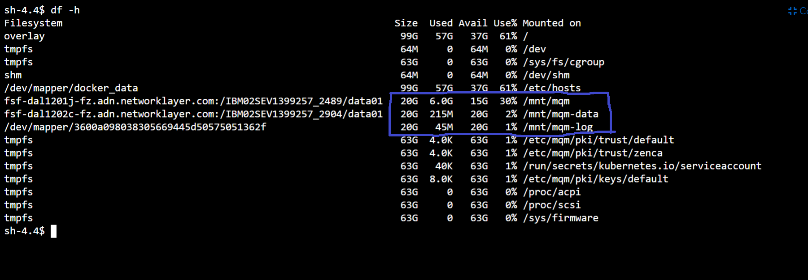
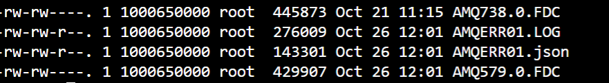
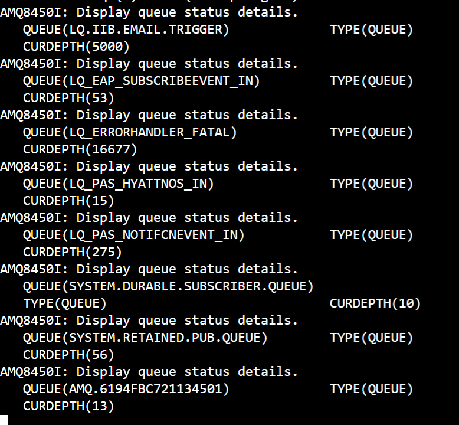
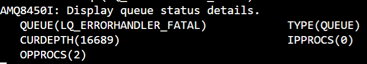
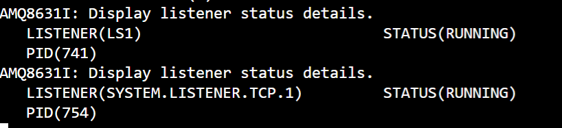

### MQ Basic HealthChecks
1. Check the Status of Queue Manager. 

   **command:** `dspmq` 
   
   
   
2. Check MQ disc space availability for Persistent volumes.
 
    **command:** `df -h`
    
    

- check the usage of **/mnt/mqm**, **/mnt/mqm-data**, **/mnt/mqm-log** , ensure this won't get exceed above 75 %, if this is more than 75 % check any queue is holding messages , so perform step 3 incase disc usage is more than 75 % . 
  
 3. Verify the recent error logs are generated or not 

    **path:** ls -ltr /var/mqm/errors
	
    go to **cd /var/mqm/errors**
	
      

- If any logs are generated with recent date, find out anything related to **IBM MQ error has occurred**

 4. Check if any queue is having more than 1 messages excluding **SYSTEM.*** queues.
     
      **command:** 
         `runmqsc <QueueManager name>`
	 
	 `dis qs(*) where(curdepth gt 1)`
	 
     
    
 - If Queue is having messages , check if the respective queue has connectivity from app instances by looking at **IPPROCS** **OPPROCS** properties.
 
        `dis qs(queuename) IPPROCS OPPROCS`
- If no app instance is connected to consume messages from the queue(i.e **IPPROCS = 0**), reach out to AD team and notify the queue situation for next action.

   

 5. Check the Queue manager listener is running fine. 
 
     **command:** 
     
     `runmqsc <QueueManager name>`
     
     `dis lsstatus(*)`
     
     
     
	- If listener is not in running mode, try starting listener using command below:
	
        `start listener(listenername)`

 6. Check if any channel in not running mode.

     **command:**
	 
     `dis chs(*) where(status ne running)`
     
     
     
	- If any channel is not in running mode, try to start the channel using command below:
	
      `start chl(channelname)`

