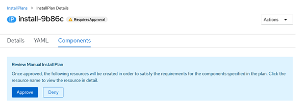

### This document covers steps to upgrade CP4I to 2021.2.1

##### Steps:
 - Upgrade “IBM CloudPlatform Common Services” to “3.9.0” in “common-service” project
 - Upgrade “IBM CloudPlatform Common Services” to “3.9.0” in “ibm-common-services” project
 - Upgrade “IBM CloudPlatform Common Services” to “3.9.0” in “cp4i-uat1” project
 - Upgrade “IBM Cloud Pak for Integration Platform Navigator” to channel“5.0” and version 5.0.0 in “cp4i-uat1” project
 - Update “integration-navigator” YAML file with “2021.2.1” version along with proper license
 - Update “IBM App Connect” Operator to “1.5.2” use channel “cd” in “cp4i-uat1” project
 - Update “IBM DataPower Gateway” operator to “1.4.0” in “cp4i-uat1” project
 - Update “IBM API Connect” Operator to “2.3.0” in “cp4i-uat1” project
 - Update “IBM MQ” Operator to “1.5.0” in “cp4i-uat1” project
 - Update “DataPower instance” 
 - Update “MQ Instance” 
 - Update “APIC Instance” to “10.0.3.1-320”
 - Update “App connect instance

## Upgrade Steps:

#### 1. Upgrade Common Service Operator in "Common-Services" namespace
  - Check the common services installer version by using the command. 
    ```
    oc get catalogsource opencloud-operators -n openshift-marketplace -o jsonpath='{.spec.image}{"\n"}{.status.connectionState.lastObservedState}'
    
    ```
    
 
  - Login into respective cluster openshift webconsole -> Operators -> Installed Operators
  - Make sure you have selected the **common-service** project.
  
     
 
  - Click on **IBM CloudPlatform Foundational Services** operators and goto **Subscription** tab. Click on **1 requires approval** option and click on **Preview Install Plan**  and select **Approve** option to install the latest version of ibm common service operator.
  
    
    
    
 
 - Wait for few minutes to complete the operator installation and verify the common services pod status simultaneously and also check the status of **IBM Cloud Pak foundational services** under **Installed Operators** and Status will be **Succeeded**.
 
   

#### 2. Upgrade the “IBM Cloud Platform common services ” in “ibm-common-services ” project
  - Login into respective cluster openshift webconsole --> Operators --> Installed Operators
  - Make sure you have selected the **ibm-common-services** project
  - Click on **IBM CloudPlatform Foundational Services** operators and goto **Subscription** tab
  - Click on **1 requires approval** option and click on **Preview Install Plan**  and select **Approve** option to install the latest version of ibm-common-service-operator.
  
    
 
    
 
    
 
    
 
 - Wait for few minutes to complete the operator installation and verify the common services pod status simultaneously and also check the status of **IBM Cloud Pak foundational services** under **Installed Operators** and Status will be **Succeeded**.

   
 
 #### 3. Upgrade Common Service Operator in **cp4i-Uat1** namespace (Note: Change the namespace name based on the environment)
  - Login into respective cluster openshift webconsole --> Operators --> Installed Operators
  - Make sure you have selected the **cp4i-uat1** project
    
  - Click on **IBM CloudPlatform Common Services** operators and goto **Subscription** tab
    
  - Click on **1 requires approval** option and click on **Preview Install Plan**  and select **Approve** option to install the latest version of ibm common service operator
    
  - Click on actions and select edit install plan.
    
  - Go to YAML file and delete the -ibm-appconnect.v1.5.1 under spec as we don’t want to update it until the CP4I upgradation.
     
  - Then click on Approve tab 
  
     
  - Wait for few minutes to complete the operator installation and verify the common services pod status simultaneously and also check the status of **IBM Cloud Pak foundational services** under **Installed Operators** and Status will be **Succeeded**. 
    

#### 4. Upgrade Platform Navigator Operator in **cp4i-uat1** project ( Note: Based on the environment choose the appropriate namespace)

 - Login into respective cluster openshift webconsole --> Operators --> Installed Operators
 - Make sure you have selected the **cp4i-uat1** project
 - Click on **IBM Cloud Pak for Integration Platform Navigator** and goto **Subscription** tab
 - Next click on Edit icon for **Channel** under Subscription Details section and select **v5.0** (ibm-integration-platform-navigator.v5.0) and **save** it.
 
   
 
   
   
   
 - Select the edit install plan option of the  navigator install plan in the installed operators.
 
   
 - Remove ibm-appconnect.v1.5.1 under spec in the install plan YAML script and save the script.
   
   
   
 - Wait for few minutes to complete the operator installation and verify the common services pod status simultaneously and also check the status of  **IBM Cloud Pak for Integration Platform Navigator** under **Installed Operators** and Status will be **Succeeded**.
  


#### 5. Update Platform Navigator Operand
  - Login into respective cluster openshift webconsole --> Operators --> Installed Operators
  - Make sure you have selected the **cp4i-uat1** project.
  
   
   
  - Click on **IBM CloudPak for integration Platform Navigator** operators and goto **Platform Navigator** tab
  - Click on the resource **Integration-navigator** and goto **YAML** section. We have to update the **spec** section in the yaml file with information.
  - Also from v5.0.0 Platform Navigator operand looks for Storage class information as well. So we have to update **license** and **Storage class** details in the below format and replace in the **Integration-Navigator** YAML section. 
i.e., Update version in storage class from 2021.1.1 to 2021.2.1 and also update the license with L-RJON-BZFQUZ.
  - This YAML file will keep on getting updated, So as quick as possible update the YAML section with required information and **save** it. If required click on **Reload** option in the yaml update and **save** it.
   
   
  
 This installation will take nearly 45 minutes to complete it. Please monitor the status in **Conditions** section under **Details** tab.
 
   
  
 Now **Integration-navigator** status should as **Ready**.
 
  
  
 Finally go to platform navigator and check if the dashboard is successfully up and running.
 
 #### 6. Upgrade IBM APP Connect Operator
 - Login into respective cluster openshift webconsole --> Operators --> Installed Operators
 - Make sure you have selected the **cp4i-uat1** project
 - Click on **IBM App Connect** operators and goto **Subscription** tab
 - Next click on Edit icon for **Channel** under Subscription Details section and select **cd** (ibm-appconnect.v1.5.2) and **save** it.
 - Now you will see Upgrade status changed to **Upgrading** and it will ask for the approval to install the operator
 >>>> The status has not shown as upgrading because there was an install plan waiting for approval. So, delete that particular plan to continue with the upgradation. 
 - Click on **1 requires approval** option and click on **Preview Install Plan**  and select **Approve** option to install the latest version of **IBM App Connect** operator
 - Wait for few minutes to complete the operator installation and verify the common services pod status simultaneously and also check the status of **IBM App Connect**   under **Installed Operators** and Status will be **Succeeded**.
 - Go to Integration capabilities in platform navigator and check whether a new version of ACE is available. 
 
  
  
  
  
  

#### 7. Update Data Power Gateway Operator
 - Login into respective cluster openshift webconsole --> Operators --> Installed Operators
 - Make sure you have selected the **cp4i-uat1** project
 - Click on **IBM DataPower Gateway** operators and goto **Subscription** tab
 - Next click on Edit icon for **Channel** under Subscription Details section and select **v1.4** (datapower-operator.v1.4) and **save** it.
 - Now you will see Upgrade status changed to **Upgrading** and it will ask for the approval to install the operator
 - Click on **1 requires approval** option and click on **Preview Install Plan**  and select **Approve** option to install the latest version of **Data power gateway** operator
 - Wait for few minutes to complete the operator installation and verify the common services pod status simultaneously and also check the status of **IBM DataPower Gateway** under **Installed Operators** and Status will be **Succeeded**.
 
  
  
  
  
  
  
  

#### 8. Update IBM API Connect Operator
 - Login into respective cluster openshift webconsole --> Operators --> Installed Operators
 - Make sure you have selected the **cp4i-uat1** project
 - Click on **IBM API Connect** operators and goto **Subscription** tab
 - Next click on Edit icon for **Channel** under Subscription Details section and select **v2.3** (ibm apiconnect.v2.3.0) and **save** it.
 - Now you will see Upgrade status changed to **Upgrading** and it will ask for the approval to install the operator
 - Click on **1 requires approval** option and click on **Preview Install Plan**  and select **Approve** option to install the latest version of **IBM API Connect** operator
 - Wait for few minutes to complete the operator installation and verify the common services pod status simultaneously and also check the status of **IBM API Connect** under **Installed Operators** and Status will be **Succeeded**.
 - Goto Integration Capabilities in cp4i console and see if the new version of APIC is available.
 
  
  
  
  
  
  
  
#### 9. Update IBM MQ Operator
   - Login into respective cluster openshift webconsole --> Operators --> Installed Operators
   - Make sure you have selected the **cp4i-uat1** project
   - Click on **IBM MQ** operators and goto **Subscription** tab
   - Next click on Edit icon for **Channel** under Subscription Details section and select **v1.5** (ibm-mq.v1.5.0) and **save** it.
   - Now you will see Upgrade status changed to **Upgrading** and it will ask for the approval to install the operator
   - Click on **1 requires approval** option and click on **Preview Install Plan** and select **Approve** option to install the latest version of **IBM MQ** operator
   - Wait for few minutes to complete the operator installation and verify the common services pod status simultaneously and also check the status of **IBM API Connect** under **Installed Operators** and Status will be **Succeeded**.
   
   
   
   
   
   

#### 10.	Update Respective Operator Instances using **platform navigator** console
 - Goto Networkingroutes location of **integration-navigator-pn** in cp4i-uat1 project.	
 - Click on **Default authentication** and provide **username/password**. We can get the **username/password** details in workloads --> secrets section --> ibm-iam-bindinfo-platform-auth-idp-credentials
 - Click on **View Capabilities**
 
   

#### 11. Update App Connect Instance
 - Click on option menu in the right corner for **Integration-dashboard** 
 - Select the mentioned **Latest version** in the drop down menu and click on **Change version** option.
 - This will take time to upgrade and you can verify the status under **Integration Capabilities** section as **Ready**

#### 12. Update APIC Instance 
 - Click on option menu in the right corner for **API Management**
 - Select the mentioned **Latest version** in the drop down menu and click on **Change version** option.
 
   
   
   
   

#### 13. Update DataPower Instances
 - Click on Navigation Menu in the page Top Left side  Select **Integration runtimes **  under Administration
 - Click on option menu in the right corner for **Gateway** type 
 - Select the mentioned **Latest version** in the drop down menu and click on **Change version** option.
 - This will take time to complete the upgrade ..Wait till the status change to **Ready**

**Note:** The same process can be followed all other remaining datapower instances

#### 14. Update IBM MQ instances
 - Click on option menu in the right corner for **Messaging** type and select **Change version** option.
 - Select the mentioned **Latest version** in the drop down menu and click on **Change version** option.
 - This will take time to complete the upgrade. Wait till the status change to **Ready**

**Note:** The same process can be followed all other remaining MQ instances


