### **METLIFE GEN2 DATAPOWER CICD PIPELINE** 

#### GITLAB:  
**Git Code**-->https://gbsgit.edst.ibm.com/MetlifeDatapower/datapower-gen2

**Git DP Config**-->https://gbsgit.edst.ibm.com/Metlife-Gen2-DevOps/gen2-dp/gen2-dp-devops

#### GITLAB and its branches:
 1. gen2-develop branch is for DEV, INT1.
 
 2. gen2-release branch is for UAT1, UAT2.
 
 3. gen2-hotfix-golive for PPD, PROD, DR.
 
 4. gen2-master branch is having the copy of code committed in PROD and DR.

#### DEPLOYMENT through Jenkins and UCD:
  1. Only Jenkins and no UCD involved for deployment in below environments: 

            DEV, INT1, UAT2, PPD.

  2. Jenkins and UCD involved for deployment in below environments:

            UAT1, PROD, DR.
  3.	While deploying in UAT1 it would use same build number as of UAT2 in Jenkins and the approval process of deployment is by Release management team through UCD.

  4.	While deploying in PPD it would use approval process by Release management team(RM Team) through UCD.

  5.	While deploying in PROD and DR it would use same build number as of PPD in Jenkins and the approval process is by RM Team through UCD.

#### CONFIG FILE LOCATION:
  1. To change DP PMGW setting changes like disable persistent connection, HealthCheck enable in loadbalancer group, we have to refer the below config files in GitLab.
     
    For config:
    MetlifeDatapower->Datapower-Gen2->config->nextgen-outbound->nextgen-outbound.cfg

    For local:
    MetlifeDatapower->Datapower-Gen2->local->nextgen-outbound->nextgen-outbound.cfg
    
  
  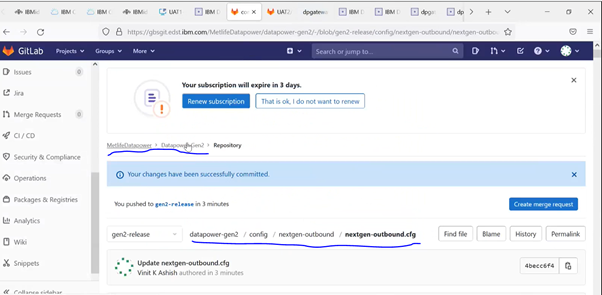
  
  
  2. To change DP Endpoint URL’s(backend Metlife API URL’s, DSIL backend queue, WCA, Vertex etc) of MPG’s, Metlife APIC Username and password, we have to refer the below
    config.properties file in GitLab.

    For config:
    Metlife-Gen2-DevOps->Gen2-DP->Gen2-DP-DevOps->**Environment name**->config.properties

    For local:
    Metlife-Gen2-DevOps->Gen2-DP->Gen2-DP-DevOps->**Environment name**->local.properties
    
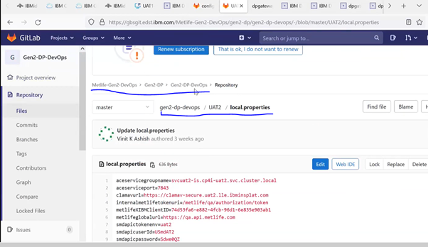
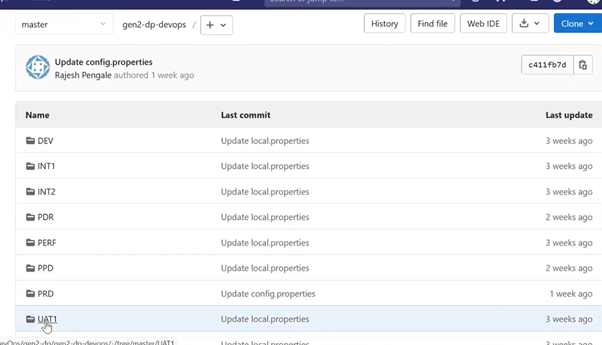
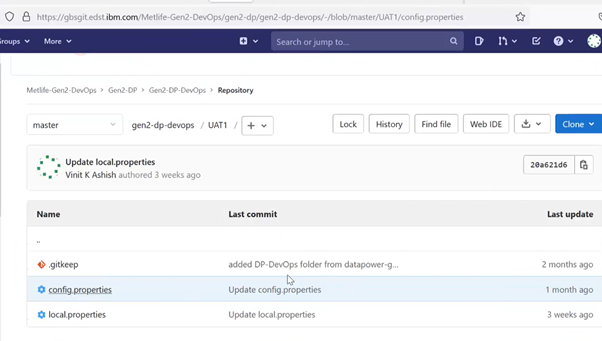
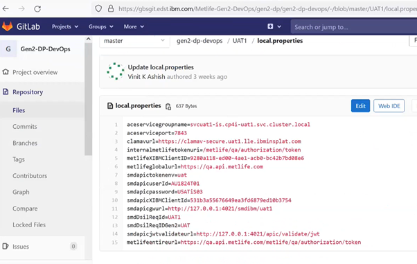
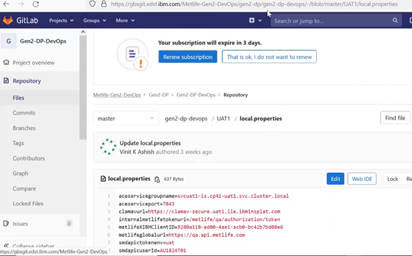
    
#### Example Deployment Tasks:
We are going to do enable HealthCheck and change HealthCheck Type as “TCP Connection” from “Standard” in LoadBalancer Group through CICD pipeline.
#### INT1:

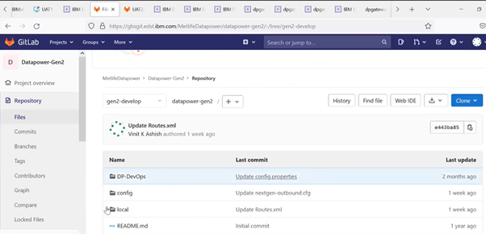
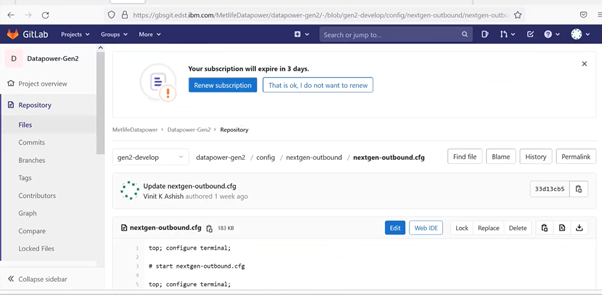

 - Right now, HealthCheck is in disabled state for **“gbdplb”** and **“pasdplb”** loadbalancer group.**“no admin-state”** indicates that HealthCheck is in disabled status, to make it enable we have to remove the **“no”** word for the admin-state.

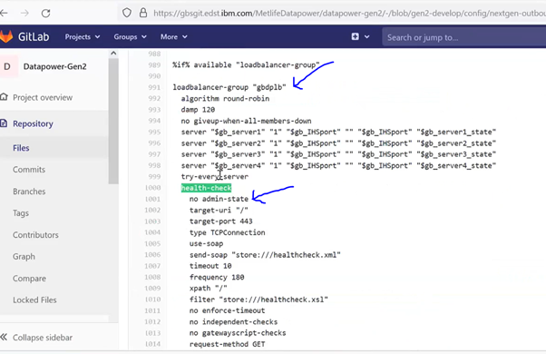
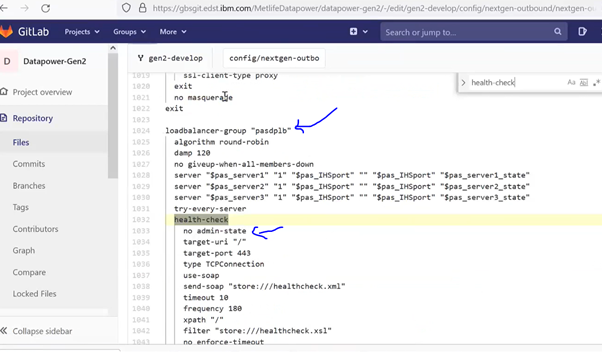

- After removing “no” word for HealthCheck **“admin-state”**

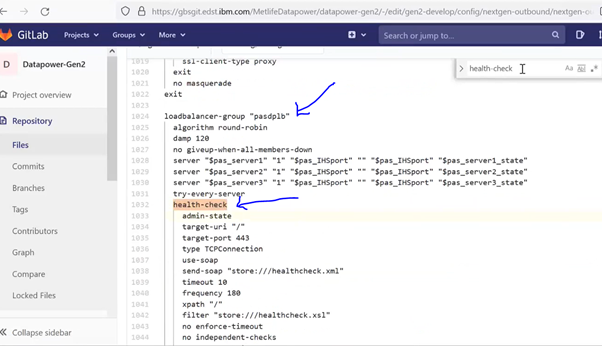
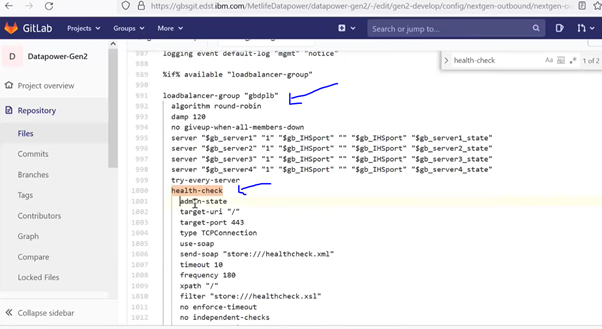
- Change type as “TCP Connection” and port as **“443”**

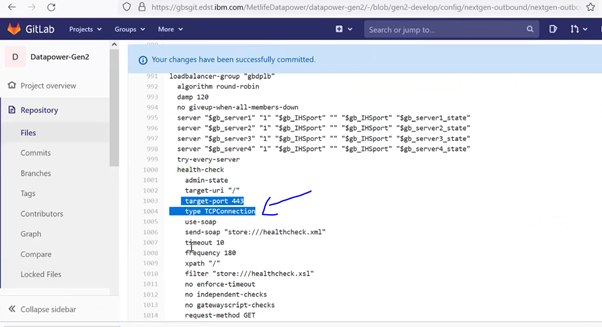

- Commit the changes in GitLab.

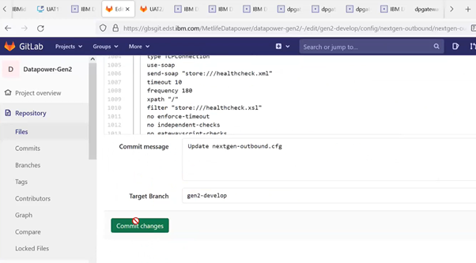
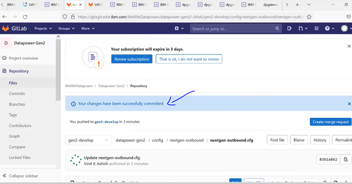

#### Log into Jenkins:

https://gbsjenkins.edst.ibm.com/job/Gen2-CP4I/view/DP-Gen2/job/Gen2-Datapower/
Click “Build with Parameters”

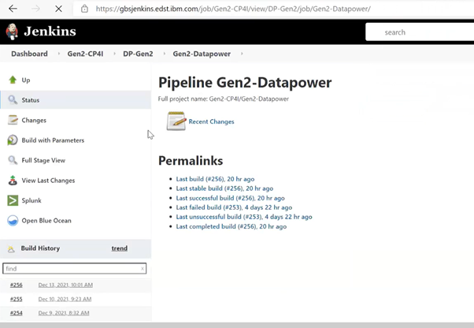
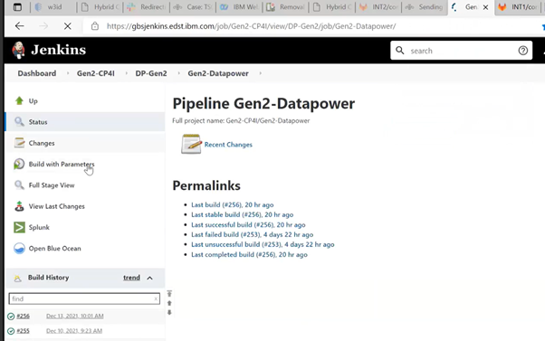
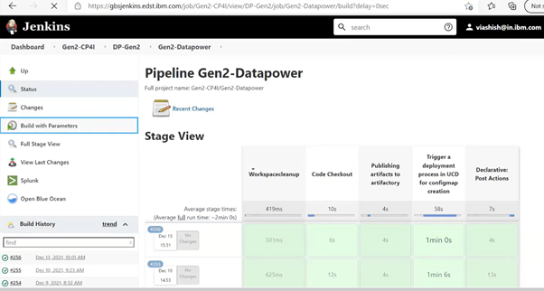

- Select as below for the deployment:

  Branch as “**gen2-develop**”
  
  Domain as “**nextgen-outbound**”
  
  Type as choose both “**local**” & “**config**”
  
  Build type as “**Update**”
  
  Environment as “**INT1**”

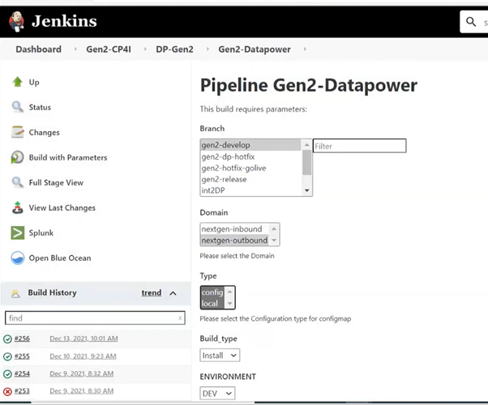
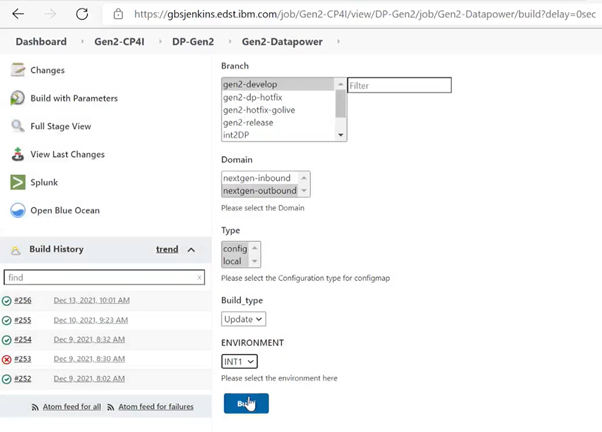

Deployment started in Jenkins

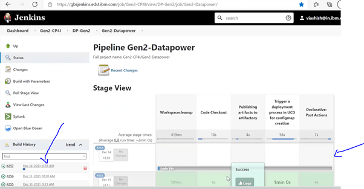
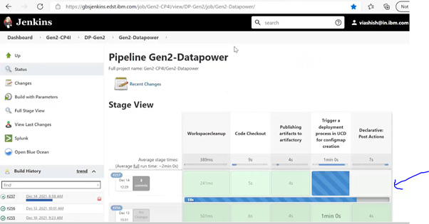

After this step, CP4I DP pod would be restarted to make changes reflect in DP configurations.

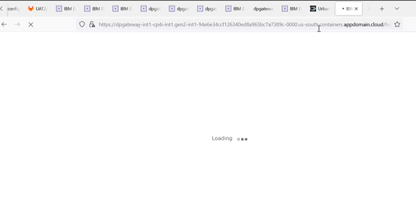
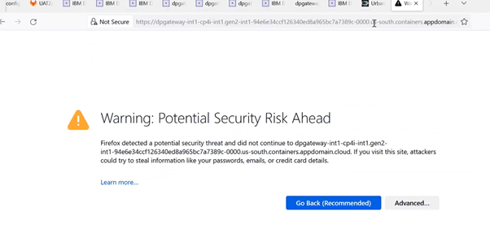
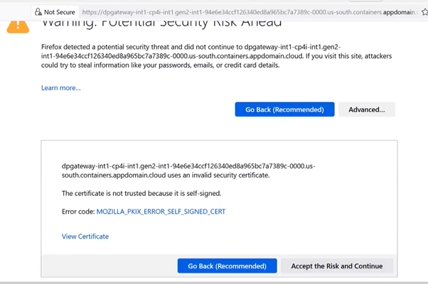
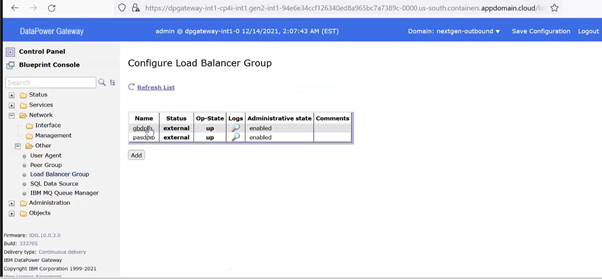

Now the HealthCheck is being enabled and HealthCheck Type as “TCP Connection” from “Standard”.

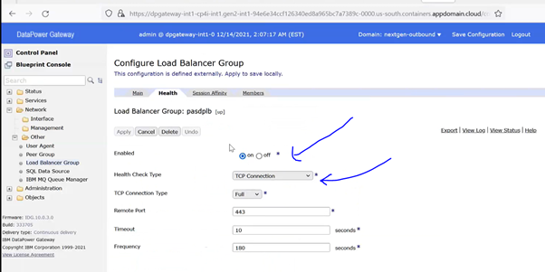

Deployment has been done in INT1.

#### Deployment Flow through UCD :

UCD:
https://gbsucd.in.dst.ibm.com:8443/

1.	We need to go to Applications tab after login to UCD.

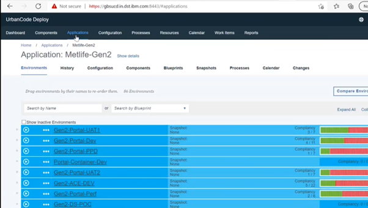

2.	Under Applications go to Metlife-Gen2.

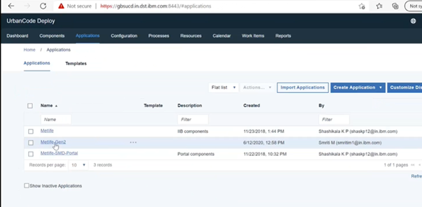

3.	We need to locate the environment which we need to deploy and click on process button, here for instance we are taking as UAT1 environment.

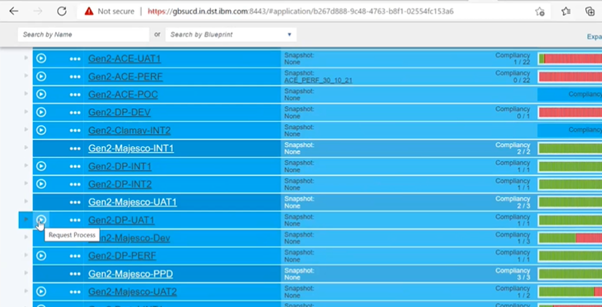

4.	Uncheck the only Changed version checkbox and give the process name as SMD-DP-Gen2 and click on Choose versions.

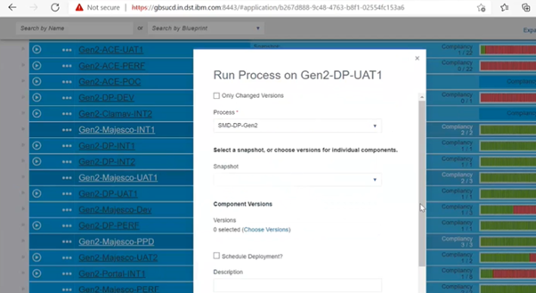

5.	Locate the build number which is in Jenkins under the build versions to deploy, then request will go to Release management team for approval then the deployment will be completed.

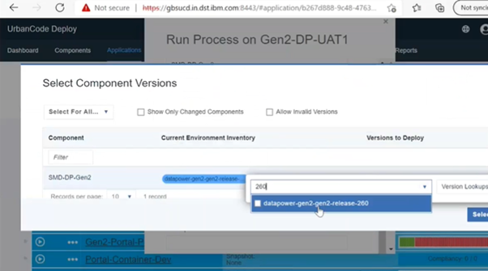

#### NOTE: For PPD deployment we do not require to explicitly go in UCD and raise a request for deployment, we just need to create build through Jenkins and ask the RM Team for approval through UCD and then deployment process will be completed, The same build number of PPD would be used in PROD and DR.

  
  
