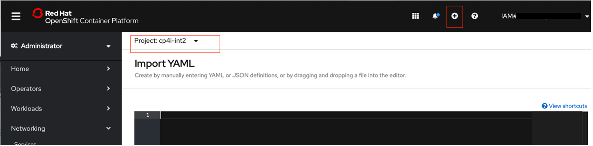

# **Gen2 Environment Onboarding helping guide**

**Audience:** This document details about the MetLife Gen2 EnvironmentPre and Post Build steps and it will be used by the Run and manage who wants to build new cluster Platform. 

# Contents
- [**Gen2 Environment helping guide**](#cluster-onboarding-helping-guide)

- [Contents](#contents)
    - [OCP Cluster Build](#ocp-cluster-build)
      - [How to create new single and multizone Openshift cluster](#how-to-create-new-single-and-multizone-openshift-cluster)
      - [Add Portworx Bare Metal Nodes](#add-portworx-bare-metal-nodes)
    - [COS Setup](#cos-setup)
    - [Portworx Setup](#portworx-setup)
      - [How to install Portworx](#how-to-install-portworx)
      - [Configure admission control on portworx daemonset](#configure-admission-control-on-portworx-daemonset)
    - [Post Cluster Network Setup](#post-cluster-network-setup)
      - [How to create Static Metlife Route](#how-to-create-static-metlife-route)
      - [Worker Node IPs Natting for MetLife](#worker-node-ips-natting-for-metlife)
      - [VPN tunnel between Liberty Platform & Gen2](#vpn-tunnel-between-liberty-platform-gen2)
      - [Firewall Update](#firewall-update)
      - [Cloudflare Setup](#cloudflare-setup)
    - [Private Ingress Setup](#private-ingress-setup)
      - [How to setup Private Ingress Controller?](#how-to-setup-private-ingress-controller)
    - [Access the cluster](#access-the-cluster)
    - [Portal Prerequisites](#portal-prerequisites)
      - [How to setup Service mesh](#how-to-setup-service-mesh)
      - [How to setup AppID](#how-to-setup-appid)
      - [Add Segmentation lebel for istio-system namespace](#add-segmentation-label-for-istio-system-namespace)
      - [UCD Agent Installation](#ucd-agent-installation)
      - [Service Account creation](#service-account-creation)
      - [ClamAV Deployment](#clamav-deployment)
    - [CP4D Installation and setup](#cp4d-installation-and-setup)
    - [CP4I Installation and setup](#cp4i-installation-and-setup)
    - [Majesco VSI and Setup](#majesco-vsi-and-setup)
      - [VSI Provisioning](#vsi-provisioning)
      - [PAS Middleware setup](#pas-middleware-setup)
      - [PAS Application Deployment](#pas-application-deployment)
      - [PAS Shared Mount creation](#pas-shared-mount-creation)
      - [PAS-WAS-MQ Configuration](#pas-was-mq-configuration)
      - [PAS Database SQL setup and configuration](#pas-database-sql-setup-and-configuration)
      - [GB Middleware setup](#gb-middleware-setup)
      - [GB Application Deployment](#gb-application-deployment)
      - [GB Shared Mount creation](#gb-shared-mount-creation)
      - [GB-WAS-MQ Configuration](#gb-was-mq-configuration)
      - [GB Database SQL setup and configuration](#gb-database-sql-setup-and-configuration)
    - [Database VSI and Setup](#database-vsi-and-setup)
   
## OCP Cluster Build
   
### How to create new single and multizone Openshift cluster

Steps to create single or multi zone OCP Cluster
- Login into IBM Cloud console [link](https://cloud.ibm.com) using your w3id and credentials
- click on the navigation menu option and select Openshift-->Clusters
  
- Click on `Create Cluster` option and it will go to the cluster creation page
  
- In cluster creation page, please select `Orchestration service`. Select the latest version in the option
  
- Next select `OCP entitlement` option as `Purchase additional licenses for this worker pool`
  
- Select `Infrastructure` option. There will be three infrastructures in IBM `Classic`, `VPC`, `Satelite` and we should use `Classic` Option
  
- Next we should select `Location` and `zone` 
   1. In Location we should provide in which `Resource Group` we want to deploy the cluster. For ex. if we choose `Dev` the cluster will be created under `Dev` resource group
   2. We have three zones `Dallas 10`, `Dallas 12`, `Dallas 13`. So we can select we want to deploy the cluster. In `Geography` select `North America` in `Availability` select `Single Zone` and in `Worker zone` select any of the one zone which you want to deploy
   3. If it is Multizone cluster In `Geography` select `North America` in `Availability` select `MultiZone` and in `Worker zone` select all three zones
  
  
- Next click on  `vlan edit` option under `Worker zone` to update the proper `Private vlan` and `Public vlan` for the particular `zone` and `resource group` and click on `Save` option
  
- Next need to select `Worker pool` options based on our resource requirements ( CPU, Memory, and storage ). The the appropriate values using `chanage flavor`  option. Also please select `Worker nodes per zone ` based on how many worker nodes you required in that particular zone
  
- Next `Resource details` Provide the `cluster name`
  
- Please make sure all the required details are updated in the cluster creation page and click on `Create` option
  

[Back to Top](#contents)

## COS Setup

[Back to Top](#contents)

## Portworx Setup

### How to install Portworx

These scripts can be used to install Portworx on single zone or multi zone OpenShift Cluster. Some of the key steps that are carried out during installation are -
1. Install block storage attacher plugin
2. Order block storage and authorize access
3. Attach block storage to node
4. Create Persistent Volumes
5. Create IBM Key Protect Service Instance
6. Create root key
7. Encrypt volumes with IBM Key Protect
8. Create 'Databases for etcd' service instance
9. Create service credentials for 'Databases for etcd' service instance
10. Create secrets
11. Provision Portworx

## Prerequisite -
1. **oc cli version 3.11 or higher** available on your system 
2. **ibmcloud cli version 1.1.0 or higher** available on your system
3. **key-protect plugin version 0.5.2 or higher** available on ibmcloud cli. You can check the installed plugins by running the command -
	- ibmcloud plugin list
3. If key-protect plugin is already avaliable continue with Install Portworx. If not, run the below commands to install and update the plugin
	- ibmcloud plugin install key-protect
	- ibmcloud plugin update key-protect

## Install Portworx
1. Update below properties in **portworx.properties** file
	- **env_name:** \<Environment name. e.g dev, int, int2, perf, prod etc...\>
	- **ocp_cluster_name:** \<Short name of the Openshif cluster. \>
	- **ocp_server:** \<Your Openshift cluster url\>
	- **api_key:** \<Your IBM Cloud account IAM api key to login to cluster \>
	- **no_of_zones:** \<For single zone cluster, use 1; for multi zone cluster use 3 \>
	- **datacenter_1, datacenter_2, datacenter_3:** \<Zone name of worker nodes. For single zone use the same value for all datacenters; for multi zone, use each datacenter name as values for these properties. e.g dal10, dal12, dal13..\>
	- **node_ip_1, node_ip_2, node_ip_3:** \<Private ip addresses of worker nodes. For single zone, select three worker nodes and assign their IP addresses one each to these properties. For multi zone, select one worker node each from all three zones and their IP addresses one each to these properties\>
	- **size:** \<Volume size (in GB) to be ordered\>
	- **resource_group:** \<Resource group to be used. Use the same resource group as the Openshift cluster\>
	- **key_protect_name:** \<Name of Key Protect service instance\>
	- **key_name:** \<Root key name\>
	- **etcd_db_name:** \<Name of 'Databases for etcd' service instance\>
	- **location:** \<Region where you want to create your 'Databases for etcd' service instance. Use your cluster region\>
	- **service_cred_name:** \<Service credential name of 'Databases for etcd' service instance \>
	- **api_key_name:** \<API Key name. This API key is used by Portworx to access IBM Key Protect API\>
	- **service_id_name:** \<Service ID for your account\>
	- **kp_api_endpoint:** \<IBM Key Protect API endpoint for the region where you created your service instance\>
	- **portworx_instance_name:**\<Portworx Enterprise service instance name\>
2. Run **portworx_install.sh** script
	```
	./portworx_install.sh
	```	
3. **Validation** -
	- **List the Portworx pods in the kube-system namespace:** The installation is successful when you see one or more portworx, stork, and stork-scheduler pods. The number of pods equals the number of worker nodes that are included in your Portworx cluster. All pods must be in a Running state.
	```
	$ oc get pods -n kube-system | grep 'portworx\|stork'
	```
	Sample-output
	```
	portworx-97vg4                                   1/1     Running             0          2d16h
	portworx-tvd8c                                   1/1     Running             0          2d16h
	portworx-xcvhn                                   1/1     Running             0          2d16h
	portworx-api-nkhsn                               1/1     Running             0          2d16h
	portworx-api-zxvdz                               1/1     Running             0          2d16h
	portworx-api-h9x4p                               1/1     Running             0          2d16h
	portworx-pvc-controller-7b79c898d-bbsqm          1/1     Running             10         2d16h
	portworx-pvc-controller-7b79c898d-cjl28          1/1     Running             8          2d16h
	portworx-pvc-controller-7b79c898d-mzvpc          1/1     Running             9          2d16h
	stork-59598475b7-5hfxb                           1/1     Running             9          2d16h
	stork-59598475b7-lhsz8                           1/1     Running             7          2d16h
	stork-59598475b7-n9ktr                           1/1     Running             6          2d16h
	stork-scheduler-578c9765dc-2gdj7                 1/1     Running             10         2d16h
	stork-scheduler-578c9765dc-4nb86                 1/1     Running             7          2d16h
	stork-scheduler-578c9765dc-f5p7j                 1/1     Running             7          2d16h
	```
	- **Log in to one of your portworx pods and list the status of your Portworx cluster**
	```
	$ oc exec -it -n kube-system portworx-97vg4 -- /opt/pwx/bin/pxctl status
	```
	Sample-output
	```
	Status: PX is operational

	License: PX-Enterprise IBM Cloud DR (expires in 1283 days) 
	Node ID: 83c9b3a3-4159-4f46-be44-b90495977005 
		IP: 10.95.168.24 
		Local Storage Pool: 1 pool 
		POOL 	IO_PRIORITY RAID_LEVEL 	USABLE 	USED 	STATUS 	ZONE 	REGION
		0 	LOW 	    raid0 	20 GiB 	3.0 GiB Online 	dal10 	us-south 
		Local Storage Devices: 1 device
		Device 	Path 			                        Media Type 			Size		Last-Scan
		0:1	/dev/mapper/3600a09803830566b342b507858555a35 	STORAGE_MEDIUM_MAGNETIC 	20 GiB 		25 Sep 20 14:56 UTC
		total							- 				20 GiB 
		Cache Devices: 
		No cache devices 
	Cluster Summary 
		Cluster ID: portworxstoragelayer 
		Cluster UUID: 3459063a-3c65-4464-89f7-d9b7f402bba8 
		Scheduler: kubernetes 
		Nodes: 3 node(s) with storage (3 online) 
		IP 		ID					SchedulerNodeName   StorageNode Used 	Capacity    Status 	StoragegeStatus Version		Kernel  			OS 
		10.95.168.24 	83c9b3a3-4159-4f46-be44-b90495977005    10.95.168.24        Yes         3.0 GiB 20 GiB 	    Online 	Up (This node) 	2.5.7.0-686a134 3.10.0-1127.19.1.el7.x86_64 	Red Hat 
		10.95.168.10 	2c1dac0f-6754-4377-b621-8de74dd4f0da    10.95.168.10	    Yes	        4.0 GiB	40 GiB 	    Online 	Up	        2.5.7.0-686a134 3.10.0-1127.19.1.el7.x86_64 	Red Hat
		10.95.168.16 	1a709910-0a56-4866-b440-3a75179ddf00    10.95.168.16	    Yes	        3.0 GiB	20 GiB 	    Online 	Up	        2.5.7.0-686a134 3.10.0-1127.19.1.el7.x86_64 	Red Hat 
		Warnings: 
			WARNING: Persistent journald logging is not enabled on this node. 
	Global Storage Pool 
		Total Used      : 10 GiB 
		Total Capacity  : 80 GiB	
	

### Configure admission control on portworx daemonset

There are two of Portworx nodes in the cluster. When we deploy the Portworx it will have single daemonset covers both storage and storage less nodes and that will cause unnessary quorum issues. So as part of that we have split to deamonsets ( Storage and storage less ).
  * Storage Nodes
     * In storage node external block empty disk has been attached into 3 of the worker nodes and make it as storage quorrum. And it will be used to provision Portworx PVC's for application
  * Storage less nodes
     * In Storage less there wont be any external disk and it wont participate in the quorrum. It will just having portworx daemonset running make sure the pod gets PVC's from the storage node volumes

- We have to make `Stork Scheduler` to schedule the pods in Storage node if its using portworx storage. So we have to modify the `Stork` deployment yaml in `kube-system` namespaceand update ` --webhook-controller=true ` in `command` section.
- This can be achieved through CLI or webconsole
- In CLI run ` oc edit deploy -n kube-system stork `
- Update the value `--webhook-controller=true ` in `command` section and save it. It will restart the pod.
- Through webconsole login into cluster and select `kube-system` namespace .
- Goto Workloads--> Deployments--> Stork-->YAML section--> Update the value in command section `--webhook-controller=true ` and  save it. It will restart the pod.


- Steps to define seperate daemonsets for Storage and storage less nodes
- Get the storage node ip details from [IBM Cloud Console](#https://cloud.ibm.com) and have the last octate of that IP's and update the following commands and run it. This is to get storage node details in environment variables
```
oc get no | egrep '\.(149|86|252) ' > nodes-storage
```
- next step run the following command to get existing `portworx` deamonset yaml file to modify .
```
oc get ds -n kube-system  portworx -o yaml > ds-px-storage.yaml
```
- Also copy this file and create one more file for ` storage-less` as `ds-px-storage-less.yaml`
- Edit the `ps-px-storage.yaml` file and removed the unwanted files..Keeping the example yaml file in this [ds-px-storage.yaml](Manifests/ds-px-storage.yaml) and [ds-px-storage-less.yaml](Manifests/ds-px-storage-less.yaml) . Please refer and modify it based on the environment. Always get the yaml file from the environment and not from this github. This only for example purpose.
- get all nodes environment variable 
```
oc get no --no-headers | awk '{print $1}' > nodes-all
```
- Run following command to get storage-less node details
```
for n in $(<nodes-all); do grep -q $n nodes-storage; if [[ $? -ne 0 ]]; then echo $n; fi; done > nodes-storageless
```
- Run the following command to `label` the storage node as `px/storage=true`
```
for i in $(awk '{print $1}' nodes-storage); do oc label node $i px/storage=true; done
```
- Run the following command to `label` the stoarge-less node as `px/storageless=true`
```
for i in $(<nodes-storageless); do oc label node $i px/storageless=true; done
```
- Verify ` ds-px-storage.yaml ` under containers:args section has the following information
```
      containers:
      - args:
        - -A
```
   
 - Next step update the `ds-px-storage-less.yaml ` under containers:args section remove `-A` option and add `-Z ` as below
 ```
       containers:
      - args:
        - -Z
```
   
  
 - Next run following command to apply `ds-px-storage.yaml ` and wait for sometime and make sure storage node deamonset pods are running under `portworx` deamonset
 ```
 oc apply -f ds-px-storage.yaml
 ```
 - Next run following command to apply `ds-px-storage-less.yaml ` and wait for sometime and make sure storage-less node deamonset pods are running under `portworx-storageless` deamonset
 ```
 oc apply -f ds-px-storage-less.yaml
 ```
 - We can verify by running `pxctl status` in any of the nodes and check the status
 ```
 oc debug node/nodeIP
 chroot /host
 pxctl status 
 ```
 So it will show 3 storage nodes as `Yes` and remaining nodes as `No` in storagenode column.
    
 
 
 
[Back to Top](#contents)


## Post Cluster Network Setup

### How to create Static Metlife Route

Create static routes on your worker nodes by enabling the static routes add-on for Red Hat® OpenShift® on IBM Cloud™ clusters.

## About static routes

When you configure your cluster network to communicate with other networks over the private network, you might need to add custom static routes on your worker nodes. Static routes allow worker nodes to successfully re-route response packets from your cluster to an IP address in on-premises data center through a VPN or a gateway appliance.

For example, you might use a VPN to connect your cluster to an on-premises data center over the private network. Additionally, your private VPN connection preserves the source IP address in requests between the cluster and the data center.

When an on-premises service sends a request to an app in your cluster, the worker node that your app pod is on drops the response due to reverse path filtering (RPF). RPF is a Linux kernel feature that drops any responses to IP addresses that are not listed in the worker node's routing tables. The response is dropped because the on-premises IP address that was preserved in the request is not routable by the worker node.

In this case, you can create a static route so that when a request's source IP address is from one of your on-premises subnets, the response is sent to the VPN gateway IP address instead. By adding this static route to the worker nodes' routing tables, you ensure the following:

    Response packets are not dropped due to RPF, because a routing rule that points to the on-premises IP address exists.
    Response packets are successfully routed first through the VPN gateway IP address, and then re-routed to your on-premises IP address.

The static route cluster add-on can be used to apply and manage static routes only. You are responsible for separately configuring and managing your own VPN, gateway appliance, or IBM Cloud™ Direct Link connection.


Enabling the static route add-on

To get started with static routes in Red Hat OpenShift on IBM Cloud, enable the static route add-on.

Before you begin:

    Ensure that you have the Administrator IAM platform access role for the cluster in IBM Cloud Kubernetes Service.
    Access your OpenShift cluster.


To use the IBM Cloud console:

    In your cluster dashboard, click the name of the cluster where you want to install the static route add-on.

    Click the Add-ons tab.

    On the Static Route card, click Install.

    Click Install again.

    On the Static Route card, verify that the add-on is listed.


To use the CLI:

    Target the CLI to your cluster.

    Enable the static-route add-on.


                
```
ibmcloud oc cluster addon enable static-route --cluster <cluster_name_or_ID>

````

Verify that the static route add-on has a status of Addon Ready.


            
          

    ibmcloud oc cluster addon ls --cluster <cluster_name_or_ID>

    Example output:

    Name              Version     Health State   Health Status
    static-route      1.0.0       normal         Addon Ready


## Creating static routes

After you enable the static route add-on, you can create and apply resources for custom routes.

1. Create a YAML file for a static route resource.          
              
```
apiVersion: static-route.ibm.com/v1
kind: StaticRoute
metadata:
  name: metlife-route
spec:
  subnet: "172.24.0.0/16"
  selectors:
    - key: "kubernetes.io/arch"
      values:
        - "amd64"
      operator: In
```

2. Create the static routes by applying the YAML file to your cluster

```
oc apply -f <route_name>.yaml
```

3. Verify that the static route is created. In the output, check the node_status for each worker node that the static route is applied to.

```
oc get staticroute <route_name> -o yaml
```

Example output:

```
apiVersion: static-route.ibm.com/v1
kind: StaticRoute
metadata:
 annotations:
   kubectl.kubernetes.io/last-applied-configuration: |
     {"apiVersion":"static-route.ibm.com/v1","kind":"StaticRoute","metadata":{"annotations":{},"name":"mystaticroute"},"spec":{"selectors":[{"key":"kubernetes.io/arch","operator":"In","values":["amd64"]}],"subnet":"10.94.227.46/24"}}
 creationTimestamp: "2020-05-20T16:43:12Z"
 finalizers:
 - finalizer.static-route.ibm.com
 generation: 1
 name: mystaticroute
 resourceVersion: "3753886"
 selfLink: /apis/static-route.ibm.com/v1/staticroutes/mystaticroute
 uid: f284359f-9d13-4e27-9d3a-8fb38cbc7a5c
spec:
 selectors:
 - key: kubernetes.io/arch
   operator: In
   values:
   - amd64
 subnet: 10.94.227.46/24
status:
 nodeStatus:
 - error: ""
   hostname: 10.94.227.19
   state:
     gateway: 10.94.227.1
     selectors:
     - key: kubernetes.io/arch
       operator: In
       values:
       - amd64
     subnet: 10.94.227.46/24
 - error: ""
   hostname: 10.94.227.22
   state:
     gateway: 10.94.227.1
     selectors:
     - key: kubernetes.io/arch
       operator: In
       values:
       - amd64
     subnet: 10.94.227.46/24
```

### Worker Node IPs Natting for MetLife

### VPN tunnel between Liberty Platform & Gen2

### Firewall Update

### Cloudflare Setup

[Back to Top](#contents)

## Private Ingress Setup

### How to setup Private Ingress Controller?

**Note:** Please use OCP-Post provisioning to deploy the private ingress controller...If the pipeline fail then try to follow the manual steps
https://github.ibm.com/MetLife-Gen2/MetLife-Gen2-Platform/blob/master/gen2-ocp-induction.md#post-ocp-cluster-provisioning 

Private Ingress controller will be helping to expose the application internally within the network

Prerequisite:
Make sure you have access to openshift cluster through cli
Login into the respective cluster
Clone the repo [Gen2](https://github.ibm.com/MetLife-Gen2/ML-Gen2-OCP-Onboarding.git)
Steps to follow for single zone cluster:
1. Login into respective openshift cluster through cli
2. deploy the yaml file using following command

```
oc create -f Manifests/private-ingress-controller.yaml
```
- This will create 2 replicas of `private ingress controller ` pod in `openshift-ingress` namespace

```
$ oc get pods -n openshift-ingress
NAME                                                 READY   STATUS    RESTARTS   AGE
router-private-ingress-controller-7b6fc554c6-6zhm4   1/1     Running   0          23d
router-private-ingress-controller-7b6fc554c6-vxzzm   1/1     Running   0          23d
```
- Also this will create `LoadBalancer` and `CluerIP` services based on the zone you deployed

```
$ oc get svc -n openshift-ingress
NAME                                         TYPE           CLUSTER-IP       EXTERNAL-IP      PORT(S)                      AGE
router-internal-private-ingress-controller   ClusterIP      172.21.210.165   <none>           80/TCP,443/TCP,1936/TCP      23d
router-private-ingress-dal10                 LoadBalancer   172.21.62.98     10.176.93.42     80:30214/TCP,443:30907/TCP   23d

```

Steps to follow for Multi zone cluster:
1. Login into respective openshift cluster through cli
2. deploy the yaml file using following command

```
oc create -f Manifests/private-ingress-controller.yaml
```
- This will create 2 replicas of `private ingress controller ` pod in `openshift-ingress` namespace

```
$ oc get pods -n openshift-ingress
NAME                                                 READY   STATUS    RESTARTS   AGE
router-private-ingress-controller-7b6fc554c6-6zhm4   1/1     Running   0          23d
router-private-ingress-controller-7b6fc554c6-vxzzm   1/1     Running   0          23d
```
- Also this will create `LoadBalancer` and `CluerIP` services based on the zone you deployed

```
$ oc get svc -n openshift-ingress
NAME                                         TYPE           CLUSTER-IP       EXTERNAL-IP      PORT(S)                      AGE
router-internal-private-ingress-controller   ClusterIP      172.21.210.165   <none>           80/TCP,443/TCP,1936/TCP      23d
router-private-ingress-dal10                 LoadBalancer   172.21.62.98     10.176.93.42     80:30214/TCP,443:30907/TCP   23d

```

[Back to Top](#contents)

### Access the cluster
- There are two ways to access the OCP cluster 
  - Using your w3id and password through webconsole. Following are the cluster webconsole links to access the cluster. Other way you can login into [IBM Cloud console](https://cloud.ibm.com) to access the respective OCP webconsole
  
    1. [ge2-dev](https://console-openshift-console.gen2-dev-94e6e34ccf126340ed8a965bc7a7389c-0000.us-south.containers.appdomain.cloud)
    2. [gen2-int1](https://console-openshift-console.gen2-int1-94e6e34ccf126340ed8a965bc7a7389c-0000.us-south.containers.appdomain.cloud/auth/callback?code=MgZ8f2TfHxinLzCKqjrzZNqGGf_gpLdWMr5lpw528tY&state=dfbedc0)
    3. [gen2-int2](https://console-openshift-console.gen2-int2-94e6e34ccf126340ed8a965bc7a7389c-0000.us-south.containers.appdomain.cloud/auth/callback?code=771jhwUT_cjWIZp81IleJx4QBsdjg85ppD5yWI5SMHU&state=aae1c4c2)
    4. [gen2-uat1](https://osc-uat1.ibminsuranceplatform.com)
    5. [gen2-uat2](https://console-openshift-console.gen2-uat2-94e6e34ccf126340ed8a965bc7a7389c-0000.us-south.containers.appdomain.cloud)
    6. [gen2-ppd](https://console-openshift-console.gen2-ppd-94e6e34ccf126340ed8a965bc7a7389c-0000.us-south.containers.appdomain.cloud)
    7. [gen2-pdr](https://console-openshift-console.gen2-pdr-94e6e34ccf126340ed8a965bc7a7389c-0000.us-south.containers.appdomain.cloud/auth/callback?code=Aj4LOg9F0Cav4mjLyeE9yQf9iD4kJGYI0pKcLtKgaNE&state=55fd50b)
    8. [gen2-prd](https://console-openshift-console.gen2-prd-94e6e34ccf126340ed8a965bc7a7389c-0000.us-east.containers.appdomain.cloud)
    
    
[Back to Top](#contents)

## Portal Prerequisites

### How to setup Service mesh

**Note:** Please use OCP-Post provisioning to deploy the Service Mesh...If the pipeline fail then try to follow the manual steps
https://github.ibm.com/MetLife-Gen2/MetLife-Gen2-Platform/blob/master/gen2-ocp-induction.md#post-ocp-cluster-provisioning 

- These steps require the usage of the web console and not the CLI
   * Prerequisites Required Operators
  
* Change to the openshift-operators project
* Select Operators -> OperatorHub in the navigation pane
* Search for the text `**elasticsearch**`
* Click and Install `Elasticsearch Operator provided by Red Hat inc.` using `All Namespaces/4.5/Manual` as the installation parameters. **Note**: Version should be changed based on the cluster version
* You must manually approve to get each operator to install! This is **critical.**
* Back in OperatorHub search for the text `Jaeger`
* Click and install `Redhat Openshift Jaeger provided by Red Hat` using `All Namespaces/stable/Manual` as the installation parameters. **Note**: Remember to manually approve.
* Back in OperatorHub search for the text `Kiali`
* Click and Install `Kiali Operator provided by Red Hat` using `All Namespace/stable/Manual` as the installation parameters. 
**Note**: Remember to manually approve.
* Back in OperatorHub search for the text `ServiceMesh`
* Click and Install `Red Hat OpenShift Service Mesh provided by Red Hat` using `All Namespaces/stable/Manual` as the installation parameters. 
**Note**: Remember to manually approve.
* Create a new Project with this specific name and case `istio-system`. All lowercase.
* Select Operators -> Installed Operators in the left navigation pane (`istio-system` project should already be selected) and wait until all the Operators have been installed and the status column shows `Succeeded` for each row.
* Click on the service mesh row to open up the service mesh detail page
* Click on the Istio `Service Mesh Control Plane` tab and click on the `Create ServiceMeshControlPlane` button
* Replace ALL of the displayed yaml content with the content stored in this file ControlPlaneTemplate and press the `Create` button.
Wait until the Plane is installed by clicking on the `basic-install` link, scrolling to the bottom and monitoring the `Message` column.

## ServiceMeshMemberRoll

- These steps require the usage of the web console and not the CLI
   * Prerequisites Required Operators
* Go to Installed Operators -> Service Mesh -> Istio Service Mesh Member Roll
* Click the Create `ServiceMeshMemberRoll`
* Replace the members list with the exact project names you need to add to the Mesh
* Click the `Create` Button
* Click on Workloads -> Pods in the left  navigation pane and make sure all the pods are in a Running state

### How to setup AppID

**Note:** We dont have automation ready yet for AppID , so please follow the manual steps

##### Prerequisites
   - Make sure you have required privilleged access to the clusters
   - Verify `Service Mesh` is installed in the cluster under `istio-system` namespace. Without `Service Mesh` we cant install `AppID`
   - oc cli

**Note**: These steps require the usage of the CLI and not the web console

#### AppID New Installation

* Run `oc project istio-system`
* git clone https://gbsgit.edst.ibm.com/Admin-Metlife/GSSP-SMD/helm-chart.git
* Goto the `helm-chart` directory 
* Run `helm install appidentityandaccessadapter ./appidentityandaccessadapter`
* `oc get pods` and make sure you see `dpl-appidentityandaccessadapter` in a running state.
* Redis hold OIDC session state and is designed to run inside istio-system and not be shared with any other project and the default values in values.yaml reflect this. That said, these values can be  overridden in the future to point to a shared Cloud instance of Redis for example.
* Original AppidAdapter Documentation (DO NOT FOLLOW THE OLD INSTALL STEPS HERE) https://cloud.ibm.com/docs/appid?topic=appid-istio-adapter#istio-install-adapter

#### AppID Upgrade

**Note**: Please make sure above mentioned prerequisites are met

* Run `oc project istio-system`
* IF there is an existing appidadapter running at least one instance of SMD running you must uninstall both the adapter and smd `helm uninstall smd`, `helm uninstall appidentityandaccessadapter` then reinstall the adapter FIRST followed by the smd instances you uninstalled. This is because of CRD dependencies between smd -> appidadapter. **Note**: Here SMD is nothing but Portal application services helm chart name
* You can use `helm ls -n istio-system` command to check already installed helm chart details
* git clone https://gbsgit.edst.ibm.com/Admin-Metlife/GSSP-SMD/helm-chart.git
* Goto the `helm-chart` directory 
* Run `helm install appidentityandaccessadapter ./appidentityandaccessadapter`
* `oc get pods` and make sure you see `dpl-appidentityandaccessadapter` in a running state.


### Add Segmentation lebel for istio-system namespace
**Note:** Please use OCP-Post provisioning to deploy the Segmentation labeling ...If the pipeline fail then try to follow the manual steps
https://github.ibm.com/MetLife-Gen2/MetLife-Gen2-Platform/blob/master/gen2-ocp-induction.md#post-ocp-cluster-provisioning 

[Back to Top](#contents)


### UCD Agent Installation

**Note:** Please use OCP-Post provisioning to deploy the UCD Agent...If the pipeline fail then try to follow the manual steps
https://github.ibm.com/MetLife-Gen2/MetLife-Gen2-Platform/blob/master/gen2-ocp-induction.md#post-ocp-cluster-provisioning 

# Running UrbanCode Deploy Agent on OpenShift cluster

This helm chart deploys UrbanCode Deploy agent on OpenShift cluster

## One time manual steps to be performed when deploying to a new cluster or project/namespace

You need to complete below steps before installing the helm chart for the first time in a new project/namespace. 

1. 	Login to OpenShift Cluster with your credentials

	```
	oc login -u apikey -p <your apikey>
	```

2. 	Create new project/namespace

	```
	oc create new-project <your new namespace>

	e.g: oc create new-project smd-ucd-agent
	```

3. 	Update values of below keys in values.yaml file
	
	- **projectname:** \<your new namespace created in **_step 2_**\>
	- **agentname:** \<agent name to be used\>

## Using helm charts to deploy ucd agent on OCP
Please refer below link to get helm installed and a basic understanding of helm charts

https://helm.sh/docs/intro/quickstart/

Before installing the chart, update the values.yaml file with actual values for each key as necessary

### helm install
Use below command to deploy the ucd agent for the first time OR to redeploy it after an uninstall

helm install \<release-name\> ucd-agent -n \<your project/namespace\>

e.g: helm install smd-ucda-release ucd-agent -n smd-ucd-agent

### helm upgrade 
Use below commond to upgrade the existing release

helm upgrade \<release-name\> ucd-agent -n \<your project/namespace\>

e.g: helm upgrade smd-ucda-release ucd-agent -n smd-ucd-agent

### helm uninstall
Use below command to uninstall the ucd agent

helm uninstall \<release-name\> -n \<your project/namespace\>

e.g: helm unistall smd-ucda-release -n smd-ucd-agent

Helm chart for this installation can be found [here](https://gbsgit.edst.ibm.com/InfraAutomationForGen2/metlife-gen2-ocp-postprovision/-/tree/master/helm-charts/ucd-agent)

[Back to Top](#contents)

### Service Account creation

**Note:** Please use OCP-Post provisioning to deploy the Service Account...If the pipeline fail then try to follow the manual steps
https://github.ibm.com/MetLife-Gen2/MetLife-Gen2-Platform/blob/master/gen2-ocp-induction.md#post-ocp-cluster-provisioning 

# Create service account and artifactory secret

This script will create service account with cluster admin role, which will be used by AppOps/DevOps team for deployment of all components from UCD 
## Prerequisite
* oc cli version 3.11 or above available on your system
## Steps
1. Edit service_account.properties file and provide values for below properties -
	- **ocp_apikey:** Your ibm cloud apikey
	- **ocp_cluster:** OCP cluster url where you wish to create the service account and artifactory secret
	- **portal_namespace:** Name of portal project
2. Run **create_service_account.sh** script
	- $**./create_service_account.sh**

Service account scripts can be found [here](https://gbsgit.edst.ibm.com/InfraAutomationForGen2/metlife-gen2-ocp-postprovision/-/tree/master/service-account-configuration)

[Back to Top](#contents)

### ClamAV Deployment

#### Requirements for Clamav:
 
• Code checkout from clamav repo

• Docker build 

• Images pushed to Artifactory and scanned using Jfrog Xray

• Deployment using helm chart

• Slack notifications  

• Deployment to be done in portal namespace

#### Informations
• Images are built with the tag as `gen2-<build-number>-<build-timestamp>` and published to Artifactory. This is in turn scanned by Jfrog Xray. Please refer Artifactory and Xray screenshots for the same.

• Notifications are published for the pipeline in slack along with link to Xray report. Please refer slack notification screenshot for the same.

• Pipelines are currently setup for the environments Dev, UAT1 and Perf ( where portal has been deployed)

• If the clamav release already exists, the deployment process uninstalls and deletes the pvc and does a reinstall

• Pipeline was tested in INT2 non-prod cluster in a test namespace and validated by Kannan

• Pipeline was used for UAT1 deployment and validated by Kannan

#### Setps for ClamAV Deployment through Jenkins Job
- Goto the link [Jenkins](https://gbsjenkins.edst.ibm.com/job/Gen2-SMD-Portal-Metlife/job/Clamav-pipeline)

- Use `Sign In with IBM w3ID` option to login


- Select ` w3id credetials` to login and it will open Jenkins home page


  - Goto `Build with Parameters` option in `Jenkins` and Select appropriate variable based on the environment
  ```
  ENVIRONMENT
  NAMESPACE
  UCD_ENVIRONMENT
  STORAGE_CLASS
  ```


- Now we can monitor the status in `Status` option in `Jenkins`


- Also we can login into the respective cluster and check the `clamav` pod status in `portal-dev` namespace . Based on the environment please select the portal namespace

- Artifactory link can be found [here](https://gbsartifactory.in.edst.ibm.com/artifactory/webapp/#/artifacts/browse/tree/General/metlife_gen2images/clamav-gen2/clamav)


- Jfrog Xray link can be found [here](https://gbsxray.in.dst.ibm.com/web/#/component/details/docker:~2F~2Fclamav-gen2~2Fclamav)


- We will get Slack notifications as well in the channel `gen2-clamav-devops-notification`


[Back to Top](#contents)


## CP4D Installation and setup

[Back to Top](#contents)

## CP4I Installation and setup

### CP4I Common Service Installation

1. Create project in Openshift Cluster 
 **Project name:** “common-service"
 
2.  Run the following command (Gives back install plans in all namespaces. to make sure all install plan are in installed state):
 
```
   oc get ip –A
```

3. Run patch command to change approved state to true for all install plans if anything is in pending / waiting for approval state in openshift-operators namespace.

```
oc patch installplan <install-plan>  --namespace openshift-operators --type merge --patch '{"spec":{"approved":true}}
```
   
4. If operators are not loading in operator hub add the catalogs:
Ref: https://www.ibm.com/support/knowledgecenter/SSGT7J_20.3/install/install_online_catalog_sources.html

5. Install common service operator from operator hub in **common-service** namespace.
Note: It creates **ibm-common-services** namespace automatically. Verify the installation in installed operators.

6. Create common service instance with small foot print (By default it create medium foot print).
Note: In “perf and prod ” hle-env keep the foot print as default (i.e. medium). Other LLE environment keep the foot print as small.
 


Update the common-service yaml content from the reference link:
Reference: https://chrisphillips-cminion.github.io/commonservices/2020/11/23/IncreaseMemoryCommonServices.html
 


7. You may see several pods in OOM Killed state apply the following patches (For recommended resource request and limits)
Reference: https://chrisphillips-cminion.github.io/commonservices/2020/11/23/IncreaseMemoryCommonServices.html

Content from the above mentioned ref page:      
While installing IBM common services (a preq for CP4I) we hit an issue were some of the pods were terminating because of memory or CPU limits. This article will show how to increase these limits.

Please note, if you need to make these changes to your system raise a PMR with IBM before applying to production systems

In kubernetes each pod can have a resources request and limit value for memory and or CPU. I highly recommend that this is set for your application. The request value is used as to determine how much resource needs to be available on a node in order to run the pod, where as the limit is the absolute maximum. If the limit value is reached the pod is cycled.

These values can be set on the Deployment (DaemonSet or StatefulSet). However in the new world of operators it is more common to have it set in the CR which will go and set the size in the deployment. This means if you change it in the CR the deployment will be overridden.

For IBM Common Services the value in the CR is set by the OperandConfigs. Therefore if you change the CR the OperandConfigs will revert you back to the original value.

If you want to set custom limits in OperandConfig then you must put the changes in the CommonServices object to over ride these values and replace the spec section with content with content similar to the following:

```
# oc edit commonservice common-services   
```   


```
spec:
  services:
  - name: ibm-cert-manager-operator
    spec:
      certManager:
        certManagerCAInjector:
          resources:
            limits:
              cpu: 1000m
              memory: 1024Mi
        certManagerController:
          resources:
            limits:
              cpu: 1000m
              memory: 1024Mi
        certManagerWebhook:
          resources:
            limits:
              cpu: 1000m
              memory: 1024Mi
        configMapWatcher:
          resources:
            limits:
              cpu: 1000m
              memory: 1024Mi
  - name: ibm-management-ingress-operator
    spec:
      managementIngress:
        replicas: 1
        resources:
          limits:
            cpu: 1000m
            memory: 1536Mi
  - name: ibm-monitoring-exporters-operator
    spec:
      exporter:
        kubeStateMetrics:
          resource:
            limits:
              cpu: 1540m
              memory: 1800Mi
  - name: ibm-iam-operator
    spec:
      secretwatcher:
        replicas: 1
        resources:
          limits:
            cpu: 1000m
            memory: 1450Mi
  size: small
```

8. Command to get console secret:

```
oc get secret platform-auth-idp-credentials  -n ibm-common-services -oyaml | grep password | sed -e s/.*:\ // | sed -e s/{}// | base64 –d
```

Note: step 7 Not applicable for common services installation.

Note: After creating common service check the pvc and verify it is in same zone ...if it is not created uninstall the common service and create the storage class with a specific zone like dal12 and set it as default storage class.

9. Custom Storage
yaml file in the same box folder

```
apiVersion: storage.k8s.io/v1
kind: StorageClass
metadata:
annotations:
   storageclass.kubernetes.io/is-default-class: 'true'
 name: cp4i-block-gold
 labels:
   kubernetes.io/cluster-service: "true"
provisioner: ibm.io/ibmc-block
parameters:
  billingType: hourly
  classVersion: '2'
  fsType: ext4
  iopsPerGB: '10'
  sizeRange: '[20-4000]Gi'
  type: Endurance
reclaimPolicy: Delete
volumeBindingMode: Immediate
allowedTopologies:
- matchLabelExpressions:
  - key: failure-domain.beta.kubernetes.io/zone
    values:
    - dal12 
```

Set that to default.

[Back to Top](#contents)

### CP4I Platform Navigator - Operator Installation

1. Create project cp4i-**xxxx**
**xxxx**---> environment (eg: cp4i-uat1, cp4i-int2, cp4i-dev, cp4i-perf)

2. Create secret for getting operators in Operator Hub. Ignore this step If already executed in Common Service installation.
Ref : https://www.ibm.com/support/knowledgecenter/en/SSGT7J_20.3/install/entitlement_key.html

```
 oc create secret docker-registry ibm-entitlement-key --docker-username=cp --docker-password=<entitlement-key> --docker-server=cp.icr.io --namespace=<target namespace>
```

**Target Namespace:** cp4i-int2
Collect the entitlement key from https://myibm.ibm.com/products-services/containerlibrary
Or using all-icr-io.yaml in the box folder

3. Install cp4i platform navigator operator
Ref : https://www.ibm.com/support/knowledgecenter/en/SSGT7J_20.3/install/install_platform_navigator.html
 

 


4. Create platform navigator


   1. Verify whether the route is created
 


5. Get credentials to access the platform Navigator

```
oc get secrets -n ibm-common-services platform-auth-idp-credentials -ojsonpath='{.data.admin_password}' | base64 --decode && echo ""
```

6. Install other operators from Operator Hub:
   - DataPower
   - App Connect
   - API Connect
   - MQ

DataPower:
Note: Select Approval Strategy as Manual 


AppConnect:
Note: Select Approval Strategy as Manual 
 


API Connect:
Note: Select Approval Strategy as Manual 
 


MQ:
Note: Select Approval Strategy as Manual 


### CP4I Instance Creation for all Capabilities and Runtimes

- **Ref:** https://www.ibm.com/support/knowledgecenter/en/SSGT7J_20.3/install/deploying.html
Access the Platform Navigator using the route created in cp4i-int2 namespace. 
- **Route name:** integration-navigator-pn
- **Route:** https://integration-navigator-pn-cp4i-int2.gen2-int2-94e6e34ccf126340ed8a965bc7a7389c-0000.us-south.containers.appdomain.cloud
- **Note:** Use credential obtained from secret (Refer to Platform navigator Installation document)
GUI to create ACE Dashboard Instance. 


1. Create ACE Dashboard Instance:
From Platform navigator UI, create capability -> App Connect Dashboard -> Next
- **LLE Env:** Select Quick Start Instance
- **HLE Env:** Select Production Instance
	
Provide Following Variables and Accept License Terms and Create Instance. 
- **Name:** ace-int2
-  Select Licence for the appropriate version (http://ibm.biz/acelicense)
- **For LLE:** AppConnectEnterpriseNonProduction
- **License for Version 11.0.0.10-r2:** L-APEH-BRZL7U
- **Storage Class:** ibmc-file-gold-gid
- **Storage Size:** 5Gi
- **Storage Type:** persistent-claim
- **License:**


Below is the reference yaml file from uat1 env for ace dashboard instance creation located in Box Folder:

[ACE Dashboard.yaml](https://ibm.ent.box.com/folder/125471714477)

**Note:** for MultiZone cluster provide a “rwx” type of portworx storage class instead of ibmc storage class. Ex:- portworx-db2-rwx-sc

1. Create APIC Instance:
From Platform navigator UI, create capability -> API Connect -> Next
- **LLE Env:** One Node – Minimum Instance
- **HLE Env:** Three Nodes - Production Instance

Provide Following Variables and Accept License Terms and Create Instance. 
- **Name:** apic
- **For LLE:** nonproduction
- **Version:** 10.0.1.0
- **Storage Class:** ibmc-block-gold

Leave rest of the values default as it is. 
Below is the reference yaml file from uat1 env for apic instance creation located in Box Folder

[APIC.yaml](https://ibm.ent.box.com/folder/125471714477)


**Note:** for Multizone cluster provide a “rwo” type of portworx storage class Ex:- portworx-db2-rwo-sc 

3. Create MQ  instance for ACE-MQ Queue Manager:
   a. Before creating mq instance for ace we need to create a configmap containing all the mq configurations for ace mq. This config file contains AD info also so that needs to be updated before creation of mq instance.
   
   b.	AD details for LLE and HLE:

		LLE
		---
		AD Server (CONNAME) - 10.38.158.139
		FINDGRP - Domain mqm
		LDAPUSER- mqm@lle.ibminsplat.com
		LDAPPWD- H@YsQV@!LsXe
		BASEDNG- CN=Users,DC=lle,DC=ibminsplat,DC=com

		HLE
		---
		AD Server (CONNAME) - 10.185.236.176
		FINDGRP - Domain mqm
		LDAPUSER- mqm@ibminsplat.com
		LDAPPWD- H@YsQV@!LsXe
		BASEDNG- CN=Users,DC=ibminsplat,DC=com

	c. We can use the following commad for configmap creation:
		
		i.	
		```
		oc create configmap <configmap-name> --from-file=<file-name>
		```
		
		ii.	Refer this config file last 4 lines for AD information related to specific environment

		
		iii.	Below is the reference file from uat env config map creation for ace-mq instance located in Box Folder (Modify only AD related info in last 4 lines If required based on env (LLE / HLE)) 
		
	[config.mqsc](https://ibm.ent.box.com/folder/125471714477)

	d. Then we need to mention this configmap in mq instance creation
	
	e. For ace MQ the naming format is :  ACE<env>QM, mft mq: MFT<env>QM (MFT MQ will be used in MFT-MQ instance creation)
    
	Steps to create mq instance for ace-mq instance:
	
	From Platform navigator UI -> Runtimes -> create instance -> MQ Queue Manager -> Next -> Select Quick Start instance -> Next
	
	Provide Following Variables and Accept License Terms and Create Instance. 
	
	- Enable **Advanced** Settings 
	- **Name:**  mq-ace-int2
	- **For LLE:** License use : NonProduction
	- Under Queue manager config, 
	- **Type of availability:**   SingleInstance for LLE, MultiInstance for HLE
	- Click on Add+ for MQSC, 
	- **Advanced:Items:**  config.mqsc
	- **Advanced:Name:**  <Configmap_name> For example : mq-ace-config

  
**For QManager:**
  
  - **Advanced:Name:** <QManager_name> For example : ACEINT2QM
  - **Class:** ibmc-file-gold-gid
  - **Type of Volume:** persistent-claim
  
**For Persistent Data Storage:**
  - **Advanced:Class:** ibmc-file-gold-gid
  - **Advanced Type of Volume:** persistent-claim
  - **Recovery logs storage:** Applicable for Multi instance (Select Portworx storage and size)
	
**For Version:**
   - **Version:** 9.2.0.0-r2

	Enable Web server  (On) and Create Instance 

**License:**
	


**QMGR config:**
		


**Configfile and the configmap:**
		


**Qmgr name:**
		


**Version:**
		


**Note:** In case of Multi instance Qmgr we need to enable Recovery Log storage details and for storage class type we can give any “rwx” kind of storage class in portworx . Ex:- portworx-db2-rwx-sc

MFT-MQ instance creation refer to: 
[MFT_MQ](https://ibm.ent.box.com/folder/128875308291)

4. Create Datapower Gateway instance:
	a. For Dp instance we need to create a secret that has the key value pair for password. 
	Create secret using below yaml content with: 

```
oc create -f dp-credential-secret.yaml
```

```
cat dp-credential-secret.yaml 
```

```
kind: Secret
apiVersion: v1
metadata:
  name: datapowerint2-creds
  namespace: cp4i-int2
data:
  password: <DB admin password>
type: Opaque
```

Note: In LLE env DP admin console password was created as weak password. Use complex password for HLE env. 

b.	Create a configmap that has the default config 
	
b.1) Use following command to create configmap

```
oc create configmap  <configmap_name> --from-file=<filename>
```

For example: 
	
```
oc create configmap datapower-config --from-file=defaultDomain.cfg -n cp4i-int2
```

b.2)  Use the following file to create a configmap:

[defaultDomain.cfg](https://ibm.ent.box.com/folder/128875308291)
 
c. Create required inbound, outbound and local configmaps:

   c.1) Receive dump file from another env (File which has config from other env DP instance)
     **How To collect DP Dump from another environment: **
     Create directory in local with 3 folders as config, localFiles, certs
        oc login to particular environment from where dump is needed
        ```
	oc project cp4i-{env}
        ```
     In config folder, run: 
     
     ```
     oc rsync <dppodName>:/opt/ibm/datapower/drouter/config/ .
     ```
   Get into nextgen-outbound domain cfg and disable below two queue manager by adding admin-state disabled as below:
   
       ```
	mq-qm "SMD.QM.ACE.01"
  	 admin-state disabled
	mq-qm "SMD.QM.DISL.01"
  	 admin-state disabled
       ```
   In local folder, run: 
      
      ```
      oc rsync <dppodName>:/opt/ibm/datapower/drouter/local/ .
      ```
      
   In certs folder, run: 
      
      ```
      oc rsync <dppodName>:/opt/ibm/datapower/root/secure/usrcerts/ .
      ```
   c.2) Switch to “DPDump/localFiles/nextgen-inbound” folder and create tar file,
     ```
	#tar -cvf nextgen-inbound.tar.gz .
     ```
	
   c.3) Create the configmap using the nextgen-inbound.tar.gz file
       ```
	# oc create configmap dp-inbound-local -n {namespace} --from-file=nextgen-inbound.tar.gz
       ```
	
   c.4) Switch to “DPDump/localFiles/nextgen-outbound” folder and create tar file,
       ```
	#tar -cvf nextgen-outbound.tar.gz .
	```
   c.5) Create the configmap using the nextgen-outbound.tar.gz file
       ```
	# oc create configmap dp-outbound-local -n {namespace} --from-file=nextgen-outbound.tar.gz
       ```
	
   c.6) Locate the “nextgen-inbound.cfg” file under “DPDump/nextgen-inbound”
	
   c.7) Create configmap using nextgen-inbound.cfg
       ```
   	# oc create configmap dp-inbound-config -n {namespace} –from-file= nextgen-inbound.cfg
       ```
	
   c.8) Locate the “nextgen-outbound.cfg” file under “DPDump/nextgen-outbound”
	
   c.9) Create configmap using nextgen-outbound.cfg
       ```
   	# oc create configmap dp-outbound-config -n {namespace} –from-file= nextgen-outbound.cfg
       ```
   c.10) Locate the nextgen-inbound certs under “
	
   c.11) Create secret for all the certs (replace the file names from the cert dumps)
   
	```
       Eg command:  #oc create secret generic dp-inbound-certs -n cp4i-int1 --from-file=DigiCertRoot.crt --from-file=DigiCertSHA2Secure.crt --from-file=MockyIoAuthorityCert.cer --from-file=dpgateway-pasPubCert.pem --from-file=mockyIORootCert.cer--from-file=qa-api-metlife-com.pem --from-file=qa-metlife-api.pem --from-file=smdint2dpg01.cer --from-file=smdintldpg01.crt --from-file=dpgateway-pasPrivKey.pem --from-file=dpgateway-cp4i-gen2-ibm-datapower-icp4i-75d7849488-mpbjg-privkey.pem --from-file=dpgateway-cp4i-gen2-ibm-datapower-icp4i-75d7849488-mpbjg-sscert.pem
       ```
    
 d. Steps to create dp instance:
      
From Platform navigator UI -> Runtimes -> create instance -> DataPower Gateway ->Next -> Select Quick Start instance  -> Next

- **Note:** Instance Type 
- **LLE:** Quick Start instance  
- **HLE:** Production instance
- Provide Following Variables and Accept License Terms and - Create Instance. 
-  Enable Advanced Settings 
- **Name:**  datapower-gw-int2
- **For LLE:** License use : NonProduction 
- **For HLE:** License use : Production 
- **Under User config:** 
- **Name:**   admin
- **Password secret:** Select the *Datapower password secret* created in step 4.a

Switch DP instance creation Yaml section and update the domain config as shown below

```
Under Domain config:
domains:
    - name: "default"
      dpApp:
        config:
          - datapower-config
    - name: "nextgen-inbound"
      certs:
        - certType: "usrcerts"
          secret: "dp-inbound-certs"
      dpApp:
        config:
          - "dp-inbound-config"
        local:
          - "dp-inbound-local"
    - name: "nextgen-outbound"
      certs:
        - certType: "usrcerts"
          secret: "dp-outbound-certs"
      dpApp:
        config:
          - "dp-outbound-config"
        local:
          - "dp-outbound-local"
```

from the Platform Navigator (Updated content) and create the resource from Openshift UI as mentioned in screenshot below,


Update the yaml section with domain and configmap detail,


**Note:** The current CP4I version had known issue that from the Platform navigator UI DP instance was not creating and was unable to select the secret value. Hence Refer the yaml file provided in reference section in this document below the DP instance screenshots, copy the content for User section credential, content for Domain section and content for Storage section and update the Yaml section in the Platform Navigator then try to initiate the create instance. If incase DP instance create option does not work from the Platform Navigator UI, Copy the yaml content 


If Platform Navigator UI have issue to create resource from Openshift UI with the yaml content updated in  Platform Navigator UI,




**Note:** for multi-zone instance cluster we need to provide a “rwo” kind of portworx storage class . Ex:- portworx-db2-rwo-sc

d. After creating the dp instance we need to create a service for it.
Use the below yaml file with your instance name in it, and create a service.

[dp-gw-web-svc-deploy.yml]()

e. Create ‘dpservice’ and expose all the ports in the yaml (attached)

```
spec:
  ports:
    - name: erl
      protocol: TCP
      port: 5004
      targetPort: 5004
    - name: metlife
      protocol: TCP
      port: 5006
      targetPort: 5006
    - name: majesco
      protocol: TCP
      port: 30001
      targetPort: 30001
    - name: dnb
      protocol: TCP
      port: 5007
      targetPort: 5007
    - name: portal
      protocol: TCP
      port: 5010
      targetPort: 5010
    - name: db
      protocol: TCP
      port: 5009
      targetPort: 5009
    - name: gen2dp
      protocol: TCP
      port: 2002
      targetPort: 2002
    - name: ace
      protocol: TCP
      port: 2001
      targetPort: 2001
    - name: specialchar
      protocol: TCP
      port: 2018
      targetPort: 2018
    - name: sftpinbound
      protocol: TCP
      port: 2402
      targetPort: 2402
    - name: sftpoutbound
      protocol: TCP
      port: 2401
      targetPort: 2401
    - name: metlifecache
      protocol: TCP
      port: 6001
      targetPort: 6001
    - name: wca
      protocol: TCP
      port: 5014
      targetPort: 5014
    - name: tws
      protocol: TCP
      port: 5015
      targetPort: 5015
    - name: majescologin
      protocol: TCP
      port: 3007
      targetPort: 3007
    - name: acedislmq
      protocol: TCP
      port: 2017
      targetPort: 2017
    - name: sftpdemotest
      protocol: TCP
      port: 2222
      targetPort: 2222
    - name: pasiib
      protocol: TCP
      port: 2007
      targetPort: 2007
    - name: pasiibhttp
      protocol: TCP
      port: 2008
      targetPort: 2008
    - name: smdmajesco
      protocol: TCP
      port: 3006
      targetPort: 3006
    - name: hwsihttp
      protocol: TCP
      port: 4009
      targetPort: 4009
    - name: smddpapichttp
      protocol: TCP
      port: 2003
      targetPort: 2003
    - name: dpapic
      protocol: TCP
      port: 4004
      targetPort: 4004
    - name: dsilgen1route
      protocol: TCP
      port: 5019
      targetPort: 5019
    - name: pasdplb
      protocol: TCP
      port: 7001
      targetPort: 7001
    - name: gbdplb
      protocol: TCP
      port: 7002
      targetPort: 7002
    - name: wcas
      protocol: TCP
      port: 50143
      targetPort: 50143
    - name: reed
      protocol: TCP
      port: 2010
      targetPort: 2010
    - name: vertex
      protocol: TCP
      port: 2004
      targetPort: 2004
    - name: majescometlife
      protocol: TCP
      port: 5008
      targetPort: 5008
    - name: pasdproute
      protocol: TCP
      port: 3005
      targetPort: 3005
    - name: gbdproute
      protocol: TCP
      port: 3004
      targetPort: 3004
    - name: sshtest
      protocol: TCP
      port: 2405
      targetPort: 2405
    - name: sftptcpproxy
      protocol: TCP
      port: 2400
      targetPort: 2400
  selector:
    app.kubernetes.io/instance: <statefulsetInstance>
  ```
  
f. After service creation, need to expose this as a webgui route:


g. We need to expose routes for Majesco to be accessed outside cluster, Use `dpservice` to expose these routes with Edge termination, share the ingress certificate with Majesco Team.  
Attached Excel sheet with required details for both LLE and HLE.
[MajescoDPRoutesExposed](Manifests/MajescoDPRexposed.xlsx)

[Back to Top](#contents)

## Majesco VSI and Setup

[Back to Top](#contents)

## Database VSI and Setup

[Back to Top](#contents)

