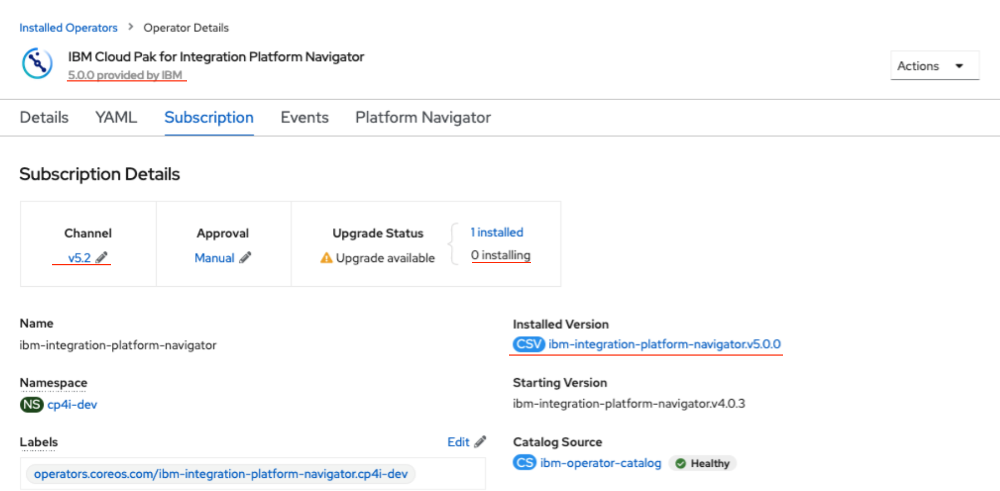

## CP4I Upgrade – Common Issues

#### IBM Cloud Pak for Integration Platform Navigator operator issue.

- Recently we faced an issue when we tried to update the Operator **IBM Cloud Pak for Integration Platform Navigator** from v5.0.0 to v5.2.0.

This kind of issue was solved applying the following workaround:

- Try to update the operator IBM Automation Foundation Core avoiding skipping versions:

	Upgrade **IBM Automation Foundation Core** Operator channel from v1.0 to v1.1, once the new Operator comes up with 1.1.0, update that new Subscription to 	v1.3, this should bring IAF to 1.3.x after that proceed to upgrade the Platform Navigator Operator.

**Also is highly recommended to check the image in the CatalogSource:**

- To get the newest version for **CP4I 2021.4** you need to update the image version in CatalogSources, please follow the instructions and details at the below link:

[IBM Cloud Pak for Integration 2021.4 - IBM operator catalog sources](https://www.ibm.com/docs/en/cloud-paks/cp-integration/2021.4?topic=upgrading-updating-your-operator-catalog-sources) 

##### Updating CatalogSource objects by using the CLI

1.-	To confirm the IBM operator catalog is up to date, run:

	oc describe CatalogSource -n openshift-marketplace ibm-operator-catalog

For the output, examine the Spec section values that begin with IBM Operator Catalog. Confirm that they match the values below;

	Spec:
	Display Name:  IBM Operator Catalog
	Image:         icr.io/cpopen/ibm-operator-catalog:latest
	Publisher:     IBM
	Source Type:   grpc
	Update Strategy:
	   Registry Poll:
   	  	 Interval:  45m
		 
If they do not match, update the values, using this command:
	
	oc edit CatalogSource -n openshift-marketplace ibm-operator-catalog

2.- Run the command below to get a list of catalog sources:
	
	oc get CatalogSource -n openshift-marketplace
	
3.- If the results include opencloud-operators, delete that catalog source 

***Note:Because foundational services are now included in the IBM Operator Catalog, you no longer need a separate (second) catalog source entry. If that entry exists, it can be deleted.:***
	
	oc delete CatalogSource -n openshift-marketplace opencloud-operators
