### Deploying a queue manager onto a ** Red Hat OpenShift ** Container Platform cluster

#### Case 1: Creating queue manager using the IBM Cloud Pak for Integration Platform Navigator
Deploying queue manager onto a Red Hat® OpenShift® Container Platform cluster using the IBM Cloud Pak® for Integration Platform Navigator.

1. In the IBM Cloud Pak for Integration Platform Navigator, click  **Administration**  then  **Integration Runtimes**.

    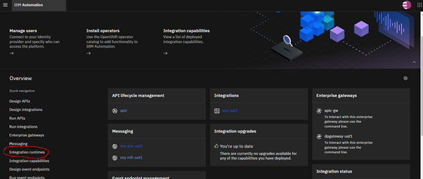

2. Click Create **Runtime**

   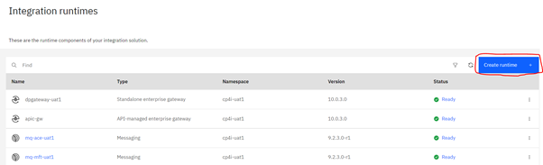

3. Select Messaging, and click Next

   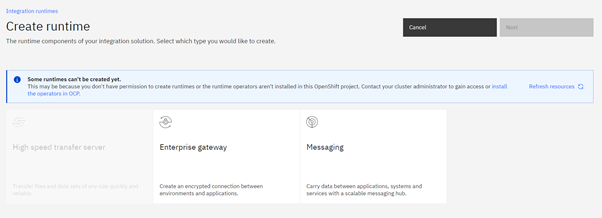
  
  The form to create an instance of a Queue Manager is displayed.

**Note:**  You can also click  **Code**  to view or change the QueueManager configuration YAML.

4. Accept the license and and click Create to deploy a new Queue Manager:

   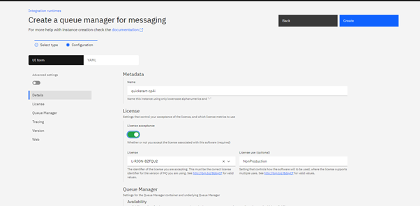

5. Type of availability and storage classes, Type of Volumes as below:
   
|Type of Availability | Storage Class  |
| -------------------:| -------:  |
|**LLE:** SingleInstance|**LLE:** ibmc-file-gold-gid |
|**HLE:** MultiInstance|**HLE:** portworx-rwx-retain-exp-sc |

 #### **Note:** In case of Multi instance Qmgr we need to enable Recovery Log storage details and for storage class type we can give any &quot;rwx&quot; kind of storage class in portworx .
 
**Ex:-**  portworx-db2-rwx-sc

Reference file from uat 1 for ace mq :

  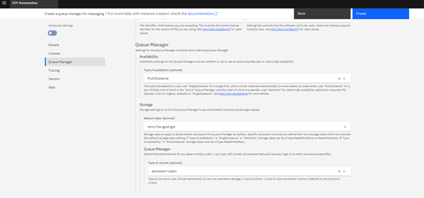

6. Click on **Advanced settings** for adding Queue manager configuration files config.mqsc and qm.ini files as below.

  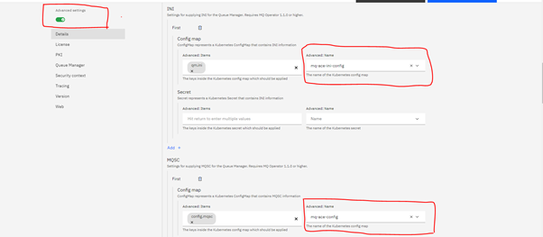

7. For CPU limit, CPU request, Memory request and Memory limit options refer below:

  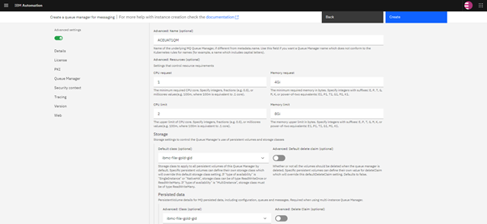

  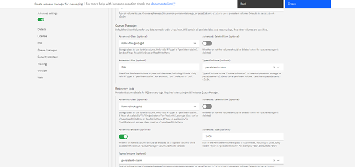

8. Click  **Create**

The list of queue managers in the current project (namespace) is now displayed. The new QueueManager should have a status of Pending.

You will be returned to the Runtime and Instances list, MQ will take a few seconds to deploy and the status will change to Ready. You may need to refresh the status by using the table refresh button
 
 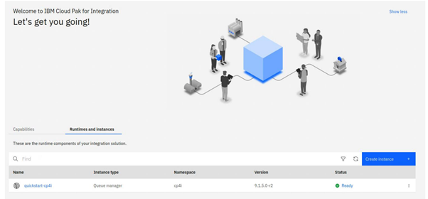

Select the newly created entry and you will be redirected to the MQ Console:

 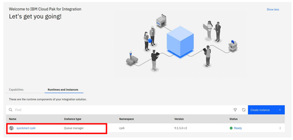

Click on the manage button from the left menu to view the details of the Queue Manager:

 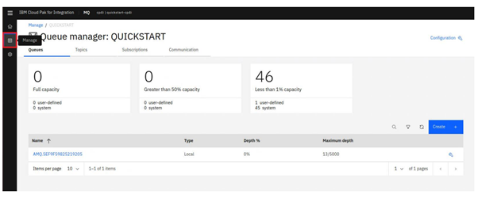

#### Case 2: Creating queue manager using the Red Hat OpenShift web console

1. In the Red Hat OpenShift web console, from the navigation pane click  **Operators** > **Installed Operators**.
2. Click  **IBM MQ**.
3. Click on the  **Queue Manager tab**.
4. Click on the  **Create QueueManager**  button.

 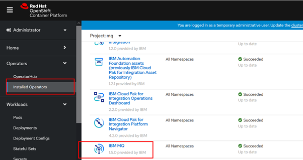

 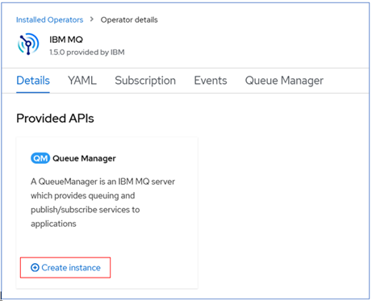

This will take you through a guided user interface allowing you to fill in the details for your queue manager. You can accept all the defaults. The only fields you will need to :

- Queue Manager instance name: quickstart-cp4i
- Accept the License (switch License field to &quot;true&quot;)

 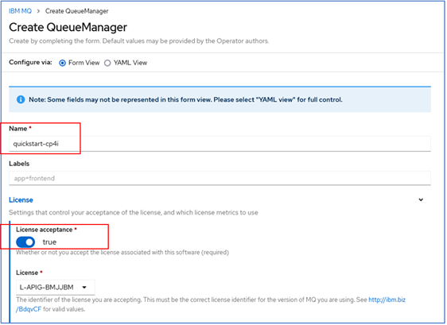

  You will notice at the top of the form that you can switch to a &quot;YAML view&quot;, and you will see that the UI as built up a file much the same as the mq-quickstart.yaml we used in Scenario 4a. Indeed this is one of the easiest ways to create a correctly formatted file that you can then use on the command line.

 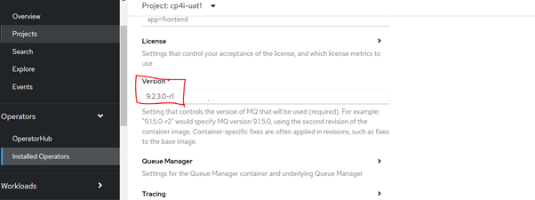

In the Advanced Configuration section, we will provide links to the ConfigMap we created earlier from the drop down list. We also need to specify the specific key within the ConfigMap to use.

  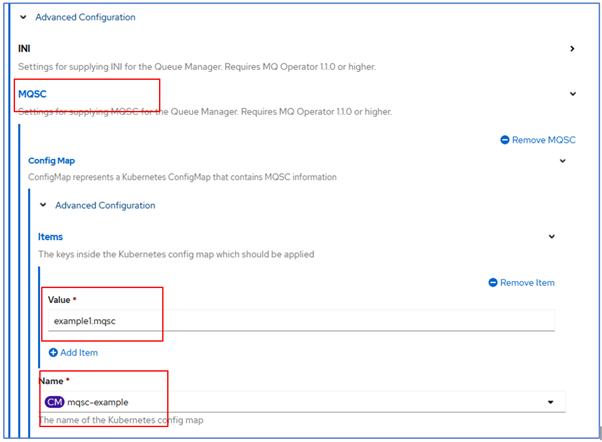

**Check the status of queue manager**

You can check the current status of all the queue manager from the Queue Manager tab.

 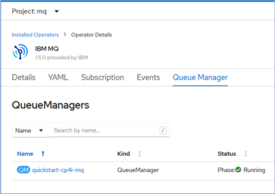

**Login to MQ Admin UI**

It is possible to log directly into the MQ Admin using the URL listed under Admin UI section as seen below. Ideally you will quickly move to creation of queue and channels via pipelines, with the definitions stored in a source code repository. Any changes made via the MQ Admin UI would then not be known to your definition file in the respository, and the next time you ran your pipeline those changes would be lost.

 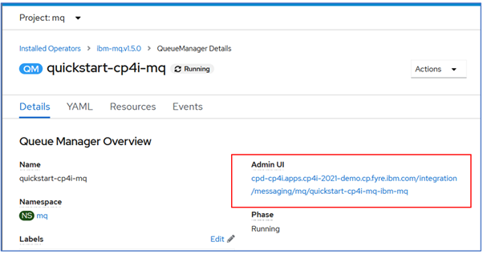

So, apart from some exceptional cases for diagnostics, all changes to the queue managers should be made via definition files, ideally stored in source code repository, and enacted by automated pipelines.

**Deleting Queue manager instance via CP4I**

  1. In the IBM Cloud Pak for Integration Platform Navigator, click  **Administration**  then  **Integration Runtimes**.

    

   

   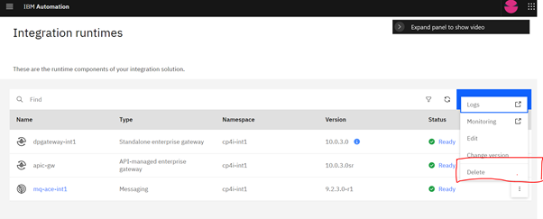

