### List of Alerts and expected Actions:

#### 1.	Pod Memory usage Warning/Critical

   -  Validate whether mentioned Pod name in the alert is belongs to Infra or Application. If its application find out who is the application owner and post this issue either through slack/email and ask them to validate and provide the appropriate Request/Limit value of Memory for the Application..Once they have provided the value , get the downtime and update the resource value accordingly for that app deployment/statefullset.
   
   - If the Pod is belongs to Infra, Validate the last week memory utilization of that pod using Grafana/Sysdig and if the utilization is constantly high over the time, then get the highest utilized memory value and give 300Mi higher from that value and update the deployment/statefullset

#### 2.	Pod CPU usage Warning/Critical

  -   Validate whether mentioned Pod name in the alert is belongs to Infra or Application. If its application find out who is the application owner and post this issue either through slack/email and ask them to validate and provide the appropriate Request/Limit value of CPU for the Application..Once they have provided the value , get the downtime and update the resource value accordingly for that app deployment/statefullset.

  -   If the Pod is belongs to Infra, Validate the last week CPU utilization of that pod using Grafana/Sysdig and if the utilization is constantly high over the time, then get the highest utilized CPU value and give 300m higher from that value and update the deployment/statefullset

#### 3.	NodeFileSystem Used Percent Warning/Critical

  -   Based on the alert check which worker node/cluster and which FS has getting filled up
  -	Try to debug into the worker node using command `oc debug node/node-ip`
  -	Validate mentioned FS has really filled up to confirm whether the alert is positive
  -	If the alert is positive, go that mount path of that FS and check which directory/file utilizing more space and see if we can able to cleanup something
  -  If the FS is Overlay, then we can check any of the Infra/Application pods using any ephermal storage

#### 4.	Kubernetes Pod Restart Rate

  -	This alert will get triggered if any of the pods are getting restarted over certain period of time interval.
  -	So if we get this alert then we need to validate why its getting restarted.
  -	We can describe the pod first and see `Exit Code` & `Reason` for the pod restart. If it is `OOM Error or 137 exit code`, then restart might because resource constraint which is set it Resource/Limit for that Pod..So we can analyse it in Grafana/Sysdig and take the decision to increase the resource if required.
  -  If the exit code & reason is not understandable then we can check the pod logs through CLI/OCP console and check any application related errors we are seeing..If any errors we can try to troubleshoot and if required we can inform AD team to check incase of any application pod.

#### 5.	Node CPU usage Warning/Critical

  -   This alert will get triggered when worker node CPU utilization is high for specified time period
  -   During this time we can run `oc adm top node node-ip` command to see the current CPU utilization of the node..We can monitor for sometime whether the utilization is coming down..
  -	If constantly utilization is high then we can start to checking which application is using more CPU in the affected worker..We can get that details through `oc describe node node-ip` or else we can dubug into the worker node `oc debug node/node-ip` and run `top` command to see which process is unusually utilizing more no of CPU and incase if the process belongs to application team then we can inform them and restart the pod which is belongs to that process so that it will move other worker…Again we need to monitor the new worker node which that issue creating application is running whether again its creating issue in that worker node also..
  
  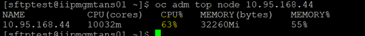
  
  
  #### 6.	Node memory usage Warning/Critical

-  This alert will get triggered when worker node memory utilization is high for specified time period
-  During this time we can run `oc adm top node node-ip` command to see the current memory utilization of the node. We can monitor for sometime whether the utilization is coming down..
-	If constantly utilization is high then we can start to checking which application is using more CPU in the affected worker..We can get that details through `oc describe node node-ip` or else we can dubug into the worker node `oc debug node/node-ip` and run `top` command to see which process is unusually utilizing more no of CPU and incase if the process belongs to application team then we can inform them and restart the pod which is belongs to that process so that it will move other worker…Again we need to monitor the new worker node which that issue creating application is running whether again its creating issue in that worker node also..

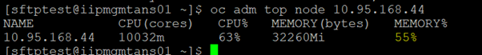

#### 7.	Kubernetes Pod Restart Count

-  	This alert will get triggered if any of the pods are getting restarted more than 20times over certain period of time interval.
-  	So if we get this alert then we need to validate why its getting restarted.
-  	We can describe the pod first and see `Exit Code` & `Reason` for the pod restart. If it is `OOM Error or 137 exit code`, then restart might because resource constraint which is set it Resource/Limit for that Pod..So we can analyse it in Grafana/Sysdig and take the decision to increase the resource if required.
-  	If the exit code & reason is not understandable then we can check the pod logs through CLI/OCP console and check any application related errors we are seeing..If any errors we can try to troubleshoot and if required we can inform AD team to check incase of any application pod

#### 8.	[Kubernetes] Node Not Ready

-  	This alert will get triggered when worker nodes goes to Not Ready state 
-  	So if we get this alert then we can describe the worker node using command `oc describe node node-ip` and see any useful events are captured in the output.
-  	Try to debug into the worker and check for the journal logs of kubelet using following commands
```
-	oc debug node/node-ip
-	chroot /host
-	journalctl -b -f -u kubelet.service
-	journalctl -b -f -u kubelet.service  --since “1 hour ago”   --this is for specific time
-	journalctl -b -f -u kubelet.service  --since “2021-10-28 23:15:00” –until “2021-10-29 23:15:00”   --this is for specific time
```

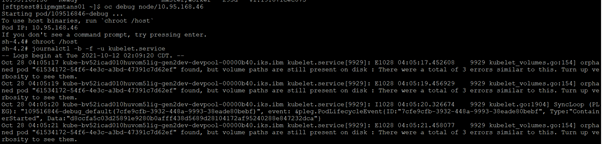


## How to Use Grafana to Validate Memory/CPU utilization of Pods/Nodes

   *  In any cluster of OCP console if we goto Monitoring --> Dashboards and select Grafana UI
   
   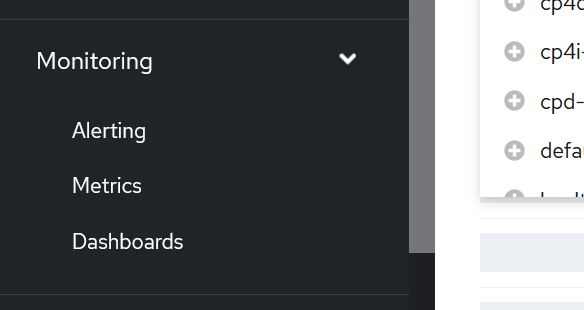
   
   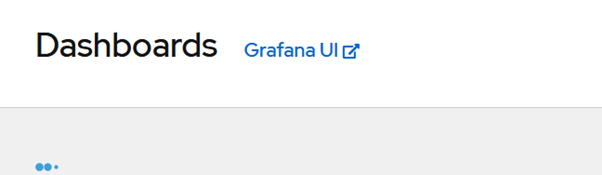
   
   *	It wil launch the Grafana page..In case of PERF/PPD/PDR/PROD cluster you need to open this dashboard from jumpserver

   *	After logging into Grafana dashboard --> Select Home option --> Manage --> Default
   
   
   
   
   *	For Pod Utlization select `Kubernetes / Compute Resources / Pod` option
   
   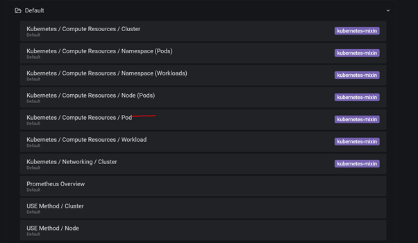
   
   *	And select which `namespace`, `Pod name` in the drop down box also select the duration of utilization you want check.
   
   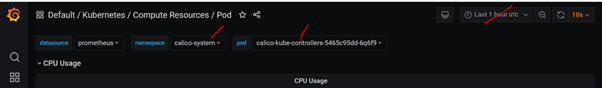
   
   
   *	For example I have selected `Redis-master` application in `istio-system` namespace for last 1 week in UAT1 cluster
   
   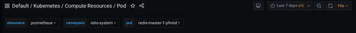

   *	And you can find the `CPU/Memory` utilization in the same page.
   
   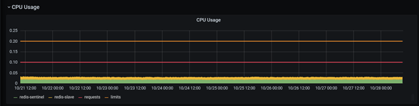
   
   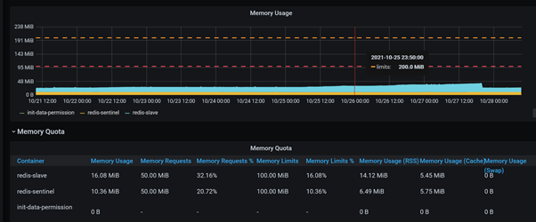
   
   * 	Also for Worker Node utilization Select Home option --> Manage --> Default --> USE Method / Node
   
   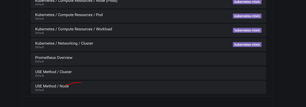
   
   * 	Select the worker node in the drop down and select the duration you want to check
   
   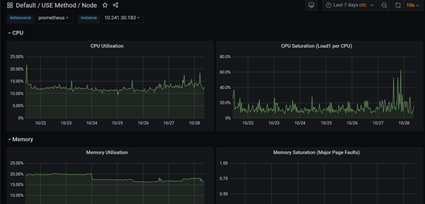
   
   
   
   ## Pod describe example to check the restart exit code and reason
   
   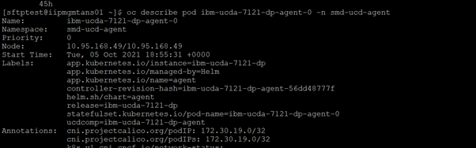
   
   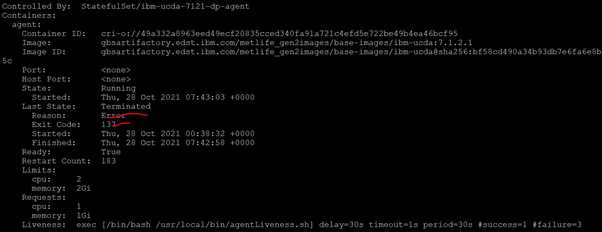
   
   
   
   
