### OCP Admin Runbook
 1. Portal troubleshoot
 2. cp4i marketplace operator (catalog source validation)
 3. DNS lookup
 4. Health check of worker node during any issue in Cluster
 5. Troubleshooting steps for Pod
 6. COS Mount issue in Prod for ACE Pod

#### 1. Portal Troubleshooting

##### Portal Prerequisite Components:
- RabbitMQ
- Redis
- MongoDB

      •	RabbitMQ and Redis applications are running with in cluster and MongoDB running in VSI ( Virtual Machine ). 
      •	All the portal applications pods having init container called readiness-verifier. This container will validate the connectivity between Redis, RabbitMQ and MongoDB.. If any of component failed to connect then rediness-verifier will fail and application pod wont come up.
      •	All the portal services included with istio-proxy for microservices connectivity..So whenever the pod is starting, it will check the rediness-verifier. Once rediness-verifier is completed, then it will bring up the istio-proxy container and then appropriate application container.
      •	Portal application pods will run on “portal-env” namespace . Note: change env based on the environment ( env: dev,int1,int2,uat1,uat2,perf,ppd,pdr,prd)
      •	RabbitMQ also running in portal namespace only. But Redis is running under istio-system namespace.
      Run following command to check whether all the portal applications pods are running fine
       `[sftptest@iipmgmtans01 ~]$ oc get pods -n portal-dev`
        clamav-2-pjkql                                 1/1     Running       148        11d
        gsspaccountsservice-2-vn25b                    2/2     Running       0          3d7h
        gsspaccountsviewservice-1-xkvzd                2/2     Running       0          3d7h
        gsspamendmentendorsementservice-1-4548p        2/2     Running       0          3d7h
        gsspamendmentendorsementviewservice-2-ssnm8    2/2     Running       0          3d6h
        gsspapplicationuiprofile-2-2642m               2/2     Running       0          3d7h
        gsspbillservice-1-2szlp                        2/2     Running       0          3d7h
        gsspbillsviewservice-1-rg8dm                   2/2     Running       0          3d7h
        gsspbookofbusinessservice-1-7plnx              2/2     Running       0          3d7h
        gsspbookofbusinessviewservice-1-k8b75          2/2     Running       0          3d7h
        gsspbrokercommonservice-4-xm596                2/2     Running       0          159m
        gsspbrokercommonviewservice-1-7727d            2/2     Running       1          3d7h

If any of the pods are failing, Please check the which container is failing in that pod by running describe command
     
`[sftptest@iipmgmtans01 ~]$ oc describe pod gsspcompensationservice-38-fcphw -n portal-dev`

Name: gsspcompensationservice-38-fcphw

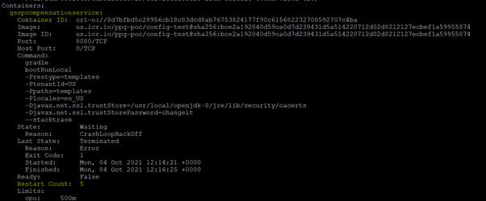

Also check the logs of that container to identify the issue
    
`oc logs po/gsspcompensationservice-38-fcphw -n portal-dev -c gsspcompensationservice`

 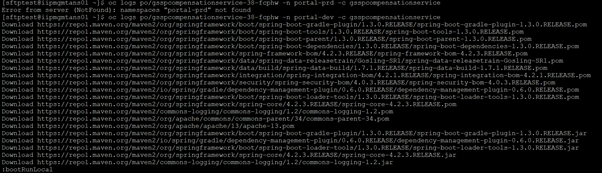

Redis instances are running in different namespace called "istio-system" .

There will be 4 redis components,
1. redis-master
2. redis-sentinel
3. redis-slave
4. resp-router

all the above four components are deployed as deployment config in that namespace.Portal applications are connecting to these redis instances. Without these redis Portal application will fail.So when any portal issue reported check the above all 4 redis components
 - redis-master will be running 1 replica
 - redis-sentinel will be 3 replica
 - redis-slave will be 3 replicas
 - resp router will be running 1 replica for LLE’s and 3 replicas for HLE’s

 All these Portal components are created as helm chart and deployed through CI/CD pipeline. Redis and RabbitMQ has been deployed via the operators
    
   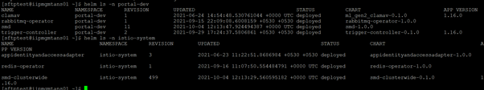

#### 2. cp4i marketplace operator (catalog source validation)

##### Catalog Source :
  CatalogSource is **a repository of CSVs, CRDs, and operator packages.** 
  Its important component which is helping to download any operator packages or installed operator version release.
  So incase of any of the operator updates are not coming, we can look into following pods and troubleshoot it.
     
  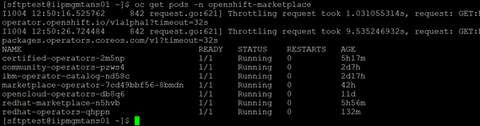


  So each community owners keeping their catalog source pods. For ex. Redhat Operator source we have redhat-marketplace and redhat-opertors catalog source
  Same like for CP4I components we have ibm-opertaor-catalog and opencloud-operators.
  So for any operator installation/upgrade issue we can check above mentioned pod logs based on that operator community. If required we can restart those pod to see the issue getting fixed.
  
####  3. DNS lookup
##### Openshift DNS:
  The DNS Operator deploys and manages CoreDNS to provide a name resolution service to pods, enabling DNS-based Kubernetes Service discovery in OpenShift.
##### DNS Operator:
  The operator deploys CoreDNS using a DaemonSet, creates a Service for the DaemonSet, and configures the kubelet to instruct pods to use the CoreDNS Service IP for name resolution.
  Use the oc get command to view the Deployment status:
     
  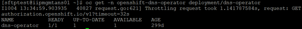

  Use the oc get command to view the state of the DNS Operator

  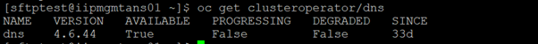
     
  Use the oc describe command to view the default dns:
  
  `oc describe dns.operator/default`

   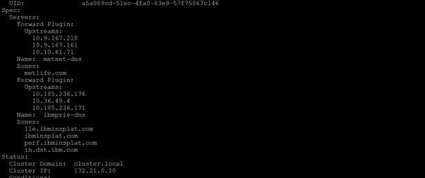

  In above screenshot:
    • The Cluster Domain field is the base DNS domain used to construct fully qualified Pod and Service domain names. ( cluster.local)
    • The Cluster IP is the address pods query for name resolution. The IP is defined as the 10th address in the Service CIDR range.

   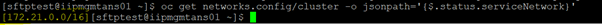

 As mentioned above DNS pods are running as deamonset and it will be running all the worker nodes in the cluster to make sure the cluster local name resolution is happening.   We can check each pod status by running the following command
 
    `oc get pods -n openshift-dns`
          
  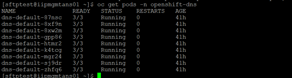

 Also we can check the logs of each pod incase of any DNS issues

   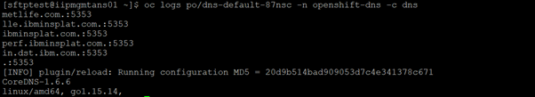

Incase of any DNS issue we can try to restart these DNS pods to see the issue getting fixed.

#### 4. Health check of worker node during any issue in Cluster

##### Monitoring Node Resources: 

 It's good to check memory and CPU available on your worker nodes from time to time and especially if your pods are stuck in Pending state or are being OOMKilled. You can do that with:

 `oc adm top nodes`

 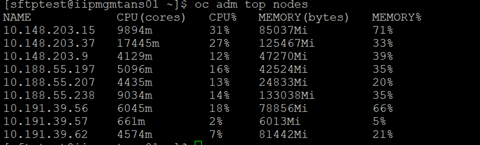

Which displays CPU and Memory stats of nodes. In case you want to filter out master nodes and see only workers, then you can use -l node-role.kubenetes.io/worker, like so:

  `oc adm top nodes -l node-role.kubernetes.io/worker`

 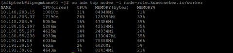

 When the information’s are not enough and you need to actually work around inside the worker node, you can run **oc debug nodes/node-name.** This would give you shell inside this specific node, by creating privileged pod on the node. Example of this kind of a interactive session:

 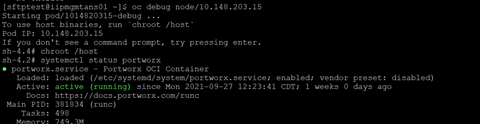

 In the session above we use **crictl** to inspect containers running directly on the worker node. This is the place where we could start/restart/delete some containers or system services if needed. Be very careful when touching things running on the nodes themselves.
 
 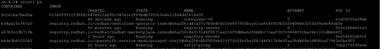

#### 5. Troubleshooting steps for Pod:

##### Daily health check for pods:

 Please ensure to provide a justification for Pod restart when asked by Application team.
 Its mandatory to check management pods which are running in below mentioned namespaces
 Instead of (int2) you have to change environment name as required.
  1.cp4i-int2
  2.cp4d-int2
  3.portal-int2
  4.kube-system
  5.istio-system
  6.openshift
 To verify the pods status
 
  `oc get po -n (Namspace details)`
  
 Describe the affected pods and look for the events
 
  `oc describe pod cert-manager-controller-78f889db49-gnsgf -n ibm-common-services`
  
`   State:          Waiting     Reason:       CrashLoopBackOff   Last State:     Terminated     Reason:       OOMKilled     Exit Code:    137     Started:      Mon, 27 Sep 2021 07:07:20 +0000     Finished:     Mon, 27 Sep 2021 07:07:50 +0000   Ready:          False   Restart Count:  272 `
      
 1. We need to look for the Reason and Exit Code in the describe output. Above example says **OOMKilled & 137**.It means what ever memory is allocated isn't enough for that application to process the request. Hence we need to increase the memory for that particular deployment/statefulset.
 2. If the Reason and Exit Code is not meaningful or understandable, then we can check the logs of that particular pod and see  for any errors and based on that action needs to be taken.
 
 `oc logs po/pod-name -n namespace -c container-name`
 
##### All The Ways to Debug Pods
- The thing that's going to break most often is ofcourse pod and/or deployment (DeploymentConfig). There's quite a few commands that can give you insight into what is wrong with your application, so starting from the most high-level ones:
 `oc status -n istio-system`   ( change the namespace based on the requirement )
 
  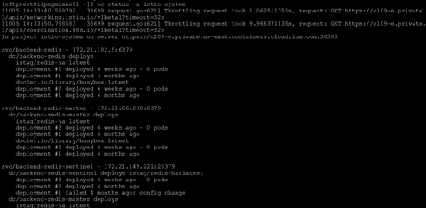

 - oc status is the easiest way to get an overview of resources deployed in project including their relationships and state as shown above.
 - Next one is `oc describe`. The reason I mention it is Events: section at the bottom, which shown only events related to this specific resource, which is much nicer then trying to find anything useful in output of oc events.
   `oc describe pod redis-master-1-r99w6 -n istio-system`
 
   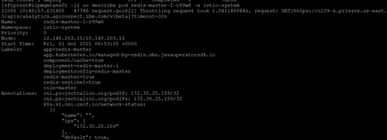
  
 - Another common is `oc logs`. One thing you might not know about it though is that it can  just target a specific container of the pod, using -c argument. For example:
 
    `oc logs po/redis-master-1-r99w6 -n istio-system`

  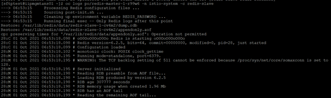

 This might come in handy while debugging single container in multi-container pod and want to filter only the relevant logs.
 - Now, for the little less known command(s). oc debug was already shown in the section about debugging nodes, but it can be used to debug deployments or pods too:

   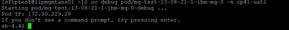
 
 Unlike the example with nodes, this won't give you shell to the running pod, but rather create exact replica of the existing pod in debug mode. Meaning, that labels will be stripped and the command changed to **/bin/sh**.
 One reason you might need to debug pod in OpenShift is issue with security policies. In that case you can add --as-root to the command, to stop it from crashing during startup. 
 Add on for this command is that it can be used with any OpenShift resources that creates pod for example Deployment, Job, ImageStreamTag, etc.

##### Running Ad-hoc Commands Inside Pods and Containers
 Even though creating debugging pods can be very convenient, sometimes you just need to poke around in the actual pods. You can use oc rsh for that. These are the variants you could take advantage of:
 
 

 First of the commands above runs one-off command inside podname with extra options if necessary. The second one will get you shell into specific container in the pod, though you should probably use shorthand for that - oc rsh.
 One command that you use could use for troubleshooting, but should never use in production environments is oc cp, which copies files to or from pod. This command can be useful if you need to get some file out of container so you can analyze it further. Another use case would be to copy files into the pod (container) to quickly fix some issue during testing, before fixing it properly in Docker image (Dockerfile) or source code
##### Gathering All Information Available
  When everything else fails, you might try running  `oc adm must-gather` to get all the information available from the cluster, that could be useful for debugging. The file produced by this command can be used for your own debugging or can be sent to Red Hat support in case you need assistance.
##### Debugging Unreachable Applications
 It's not uncommon, that applications/deployments seem to work fine but they cannot reach each other. That might be due couple of reasons. 
 Let's take following scenario - you have an application and database. Both are running just fine, but for some reason your application can't communicate with database.   Here's one way you could go about troubleshooting this

  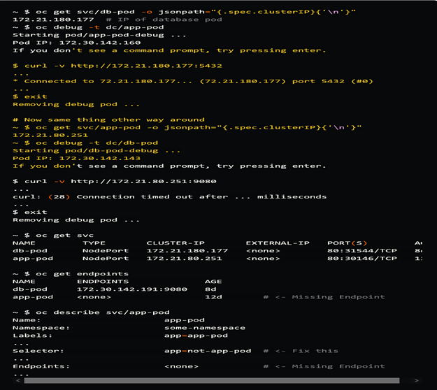

  Snippet above assumes that we already have the application and database running, as well as their respective Services. We can start debugging by trying to access the database from the application.
  1. First thing we need for that though, is IP of database, which we look up using the first command. 
  2. Next, we create carbon copy of the application using oc debug and try reaching the database pod with curl, which is successful.
  3. After that we repeat the test other way around and we can see curl times out, meaning that database cannot reach application IP. 
  4. We then check previously created Services, nothing weird there. 
  5. Finally, we check Endpoints where we can see that application pod doesn't have one. This is most likely caused by misconfiguration of respective Service, as shown by last command, where we clearly have wrong selector. After fixing this mistake (with oc edit svc/...), Endpoint gets automatically created and application is reachable.

##### Fix Missing Security Context Constraints

 If your pod is failing for any kind of issue related to copying/accessing files, running binaries, modifying resources on node, etc, then it's most likely problem with Security Context Constraints. Based on the specific error you are getting, you should be able to determine the right SCC for your pod. If it's not clear though, then there are a few pointers that might help you decide:
 If your pod can't run because of UID/GID it's using, then you can check UID and GID range for each SCC:

 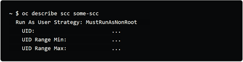

 If these fields are set to <none> though, you should go look at project annotations:

 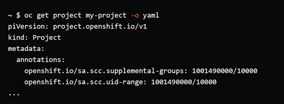

 These annotations tell you that effective UID of your pod will be in range 1001490000 +/- 10000. if that doesn't satisfy your needs, you would have to set spec.securityContext.runAsUser: SOME_UID to force specific UID. If your pod fails after these changes, then you got to switch SCC or modify it to have different UID range.
 One neat trick to determine which SCC is needed by Service Account to be able to run a pod, is to use oc adm policy scc-subject-review command:
 
 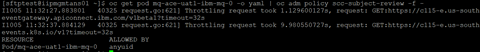

 What this command does, is check whether user or Service Account can create pod passed in using YAML representation. When output of this commands shows <none>, then it means that resource is not allowed. If any name of SCC is displayed instead, like for example anyuid above, then it means that this resource can be created thanks to this SCC.
 To use this command with some Service Account instead of user, add -z parameter, e.g - oc adm policy scc-subject-review -z builder.
 When output of this commands shows anything but <none>, then you know that you are good to go.
 
 ####  6. Validation of disk pressure alerts

Mail alert will be sent for these type of Disk Pressure incidents as in below format.Which contains the list of top 5 pods which are consuming the disk space from the worker node.


```
Disk Pressure is on uat2 cluster
Node 10.241.30.150 has got diskpressure on cluster uat2 cluster 
Total Space: 98 GB Used Space: 84GB Used FS Percentage: 85%
Top 5 Ephemeral Storage consumed Pods
50.7284 GB Used by Pod: cp4i-uat2/enrollment-tpe-svcuat2-is-68c786754c-9sj9w
0.19194 GB Used by Pod: mft-uat2/srcagent-send-mft-uat2-0-5b885b9cc-px94q
0.186317 GB Used by Pod: mft-uat2/srcagent-send-mft-uat2-1-9fcfb56cb-vxzgl
0.144615 GB Used by Pod: ibm-observe/sysdig-agent-2nqwq
0.123348 GB Used by Pod: portal-uat2/gsspsmdcomposerui-53-znt49

```
#### Validation steps:

Get into the pod and check which path exactly using the space using the following commands. 
  Path and File detail which is consuming more space in pod:
  
   ```
$ du -sh *
30G odbctrace.out
sh-4.4$ pwd
/var/log/ACEOpenTracing
sh-4.4$ ls -l
total 30469752
-rw-rw----. 1 1001 root 31200784795 Dec  4 01:33 odbctrace.out
```

Then we can update to respective team to validate it.
For example in this case it is integration server pod. 
Here We have to update to AD team to validate the disk space usage and get it fixed. 


####  6. COS Mount issue in Prod for ACE Pod
##### COS Mount issue:
  In Production (OCP) Cluster there is an issue with one of the COS bucket mount in ACE integration server pod (pod: enrollment-tpe-svcprd). There were 2 COS buckets (prd-met-int-enrollment-out and prd-met-int-enrollment-in) used in this Integration server as shown below,
      
      volumeMounts:
        - mountPath: /opt/IBM/PRD/TPAENROLLMENT/Input/Controlfiles
          name: mount-gen2-prd-met-int-enrollment-out
          subPath: Output
        - mountPath: /opt/IBM/PRD/TPAENROLLMENT/Input
          name: mount-gen2-prd-met-int-enrollment-in
          subPath: Input
       volumes:
           - name: mount-gen2-prd-met-int-enrollment-out
             persistentVolumeClaim:
               claimName: pvc-gen2-prd-met-int-enrollment-out
           - name: mount-gen2-prd-met-int-enrollment-in
             persistentVolumeClaim:
               claimName: pvc-gen2-prd-met-int-enrollment-in
  Error in POD:
    starting container process caused: process_linux.go:472: container init caused: rootfs_linux.go:72: mounting \"/var/data/kubelet/pods/6a97cea9-1c8c-477b-85c6-dcee8c18f92c/volume-subpaths/pvc-5df2d533-3045-4b33-9b68-813606ca0020/enrollment-tpe-svcprd/1\" to rootfs at \"/opt/IBM/PRD/TPAENROLLMENT/Input/Controlfiles\" caused: mount through procfd: open o_path procfd: open /var/data/criorootstorage/overlay/53f239888820923db637ba3ebd543e4eec71278f848435fbb46175a30ad22eac/merged/opt/IBM/PRD/TPAENROLLMENT/Input/Controlfiles: not a directory"

##### Analysis on this COS mount issue:
  Due to some issue in the Bucket "gen2-prd-met-int-enrollment-in", It is getting mounted as File instead of Folder.
(-rwxr-xr-x. 1 1001 aceuser  0 Sep 29 13:16 /opt/IBM/PRD/TPAENROLLMENT/Input). Hence the other bucket "gen2-prd-met-int-enrollment-out" which was trying to mount on a sub-path under /opt/IBM/PRD/TPAENROLLMENT/ was unable to mount. 

##### Temporary Fix for this issue applied:
  As per the update from Release Management Team, the Bucket "gen2-prd-met-int-enrollment-in" was not used in env, Hence it was removed from the Integration server config and the PODs were brought online.

  Untill this issue get fixed on the COS bukcet "gen2-prd-met-int-enrollment-in", the Integration server yaml need to be updated in the cluster manually to exclude the bucket from mounting and bring up the POD

##### Path Forward on this issue:
  There was an empty bucket created and validated the POD working condition on a test pod in Production Cluster. Following actions need to be executed on the PRD env to fix this issue permanently,
   1. Copy the data from existing bucket problematic "gen2-prd-met-int-enrollment-in" to a Temporary Bucket
   2. Delete and recreate the COS bucket on the same name "gen2-prd-met-int-enrollment-in"
   3. Update the enrollment integration server yaml in PRD cluster and bring up the enrollment pod with both buckets mounted.
   


