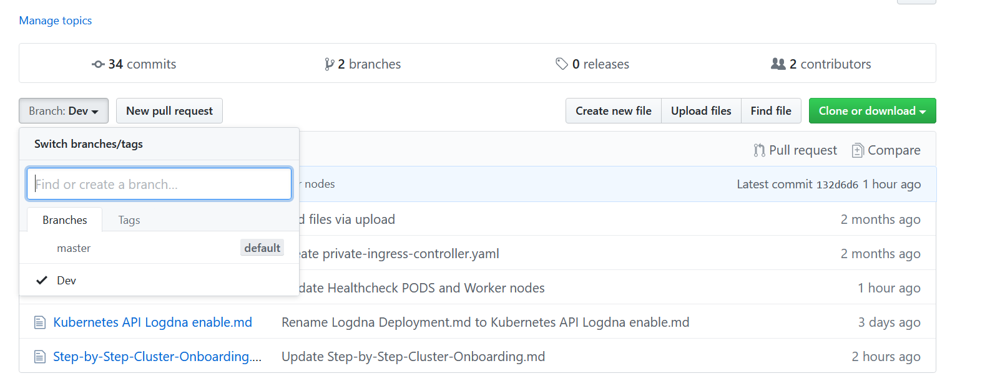
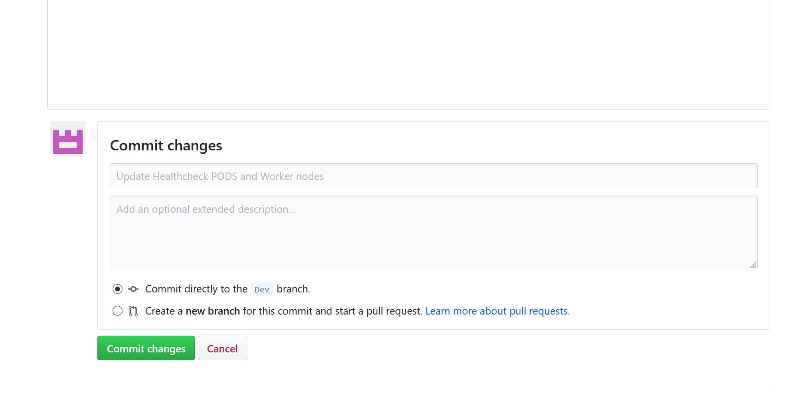
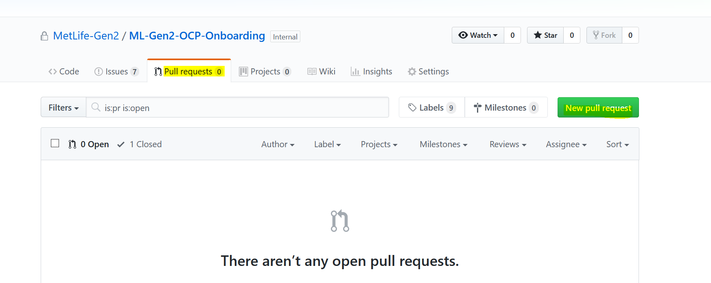
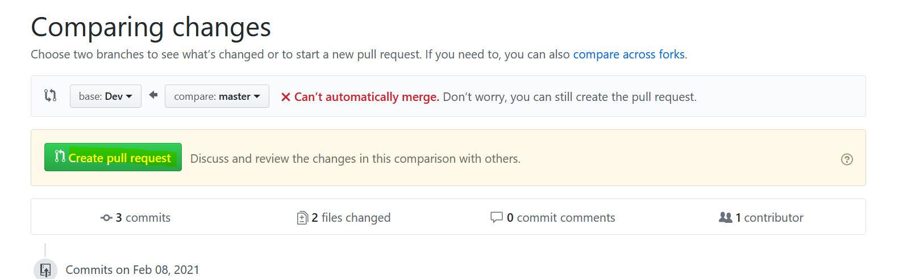
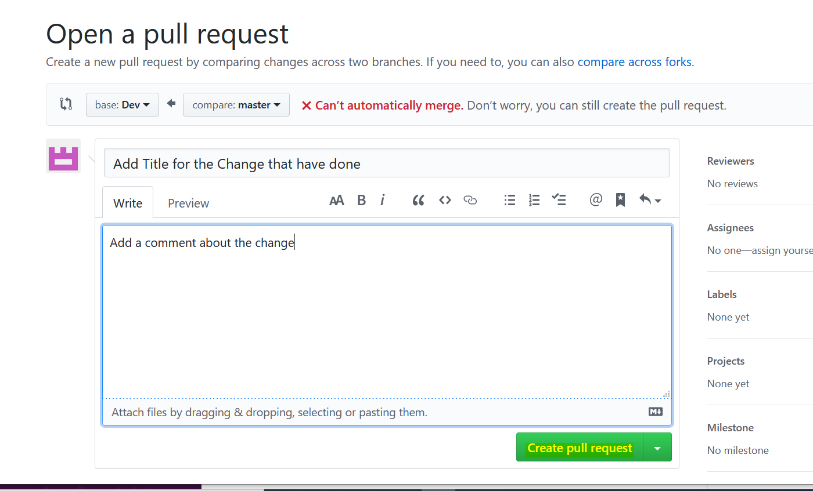

### How to create Pull Request from dev branch?

1. Select Dev branch to perform modification. Click on `Branch` and Select `Dev` option

2. Perform your changes in `Dev` branch and `Commit` your changes to `Dev` branch

3. Select `Pull requests` and click on `New pull request`

4. Select the `base:Dev ` branch in comparing changes page and click on `Create pull request`

5. Then it will load ` Open a pull request` page . As a next step `Add title and comment ` on the page and click on ` create pull request` option

### Github Markdown Documentation helping links

- [Mastering-Markdown](https://guides.github.com/features/mastering-markdown)
- [cheat-sheet](https://www.markdownguide.org/cheat-sheet)
