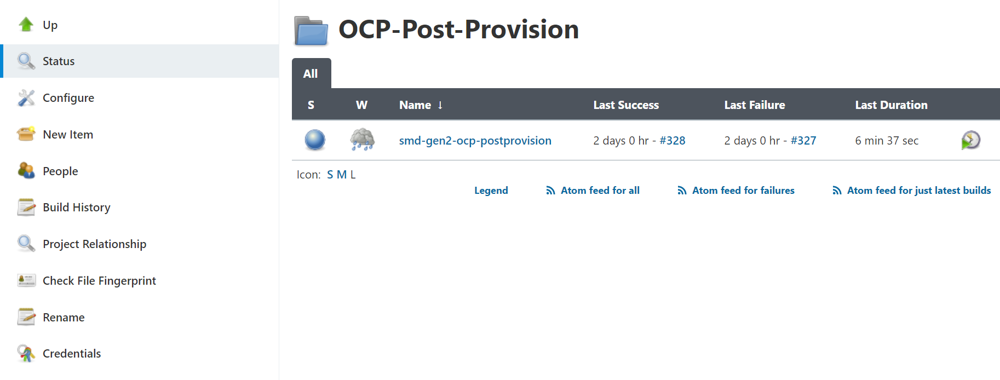
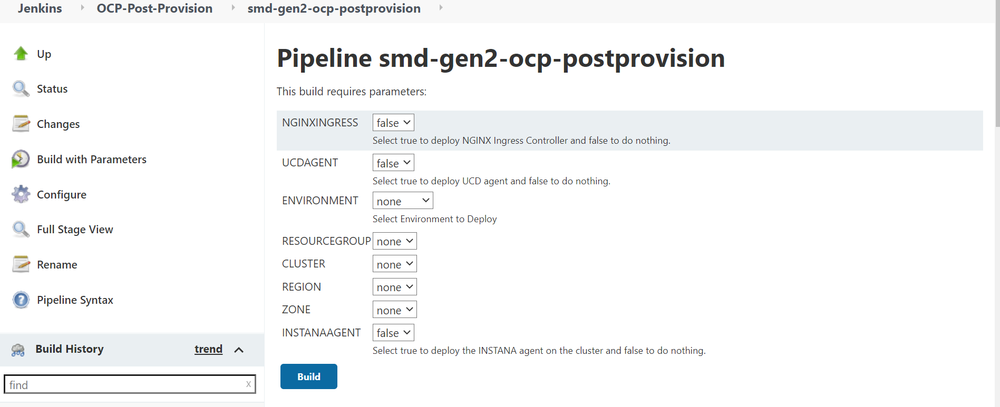
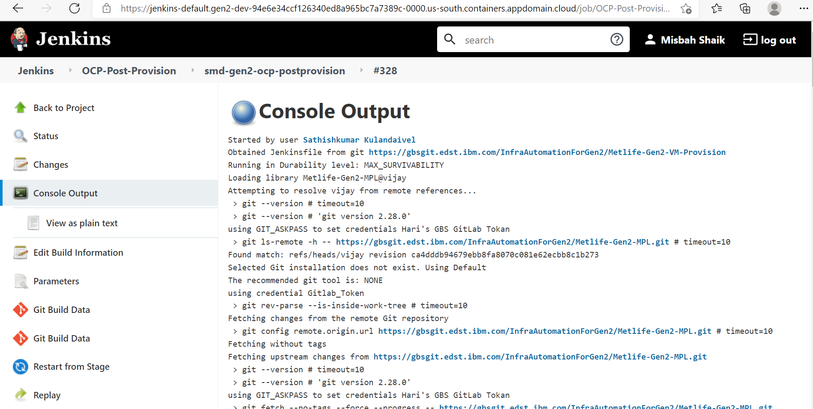

# **OCP Automation guide**

# Contents

 - [Contents](#contents)
 
     - [Maintainence Banner Enablement](#maintainence-Banner-Enablement)
	
     
     - [OCP Cluster Provision](#ocp-cluster-provision)
       	
     
     - [OCP Cluster Post Provisioning](#ocp-cluster-post-provisioning)
     
       - COS PVC creation ACE
             
       - COS PVC creation MFT
             
       - COS PVC creation TWS
             
       - Custom-scc creation (Portal, ACE)
             
       - Disk Pressure Alert Automation
             
       - DNS Health Check Automation
            
       - Private Ingress controller setup in Cluster
             
       - Logging Setup - LogDNA
             
       - Monitoring Setup - Sysdig
             
       - Prometheus - Persistence Storage creation
             
       - Service Mesh Setup
             
       - Service Account Creation (MFT, TWS, UCD)
             
       - Create Portal Namespace
             
       - Register Namespace in Istio
             
       - Elk-ace-logs
             
       - Evictedpod-cleanup
             
       - Nginx-ingress
             
       - Ocp-audit-logging
             
       - Provision S3 storage class
       
     - [OCP Workernode Upgrade](#ocp-workernode-upgrade)
    
       - [OCP Reload](#ocp-reload)
       - [OCP Upgrade](#ocp-upgrade)  
        
### Maintainence Banner Enablement
### Use of Maintainence Banner Enablement:
It is used to enable maintainence banner while doing deployments in prod environment.

[Maintainence Banner Automation Code](https://gbsgit.edst.ibm.com/InfraAutomationForGen2/metlife-gen2-cloudflare.git)

[Mainatinence Banner Jenkins Job link](https://jenkins-default.gen2-dev-94e6e34ccf126340ed8a965bc7a7389c-0000.us-south.containers.appdomain.cloud/job/OCP-Provision/job/Cloudflare-Maitenance-Banner/build?delay=0sec)
### How to do the Maintainence Banner Enablement:
1.) Click on the jenkins job link provided above.
2.) Click on build with parameters and then select the following as required:

    i)Environment (Dev,int1,uat1,uat2,perf,ppd,pdr,prd)
    
    ii)Banner (enable or disable)
    
    iii)approver mailid

[Back to Top](#contents)

### OCP Cluster Provision:
[OCP Cluster Provision Automation Code](https://gbsgit.edst.ibm.com/InfraAutomationForGen2/Metlife-Gen2-OCP-Provision)

[OCP Cluster Provision Jenkins Job link](https://jenkins-default.gen2-dev-94e6e34ccf126340ed8a965bc7a7389c-0000.us-south.containers.appdomain.cloud/job/OCP-Provision/job/smd-gen2-ocp-cluster-provision/)
### How to perform the OCP Cluster Provision:
1.) Click on the Jenkins job link provided above.
2.) Click on the build now option to start the job.
3.) Also you can see the `Build History` and the `logs`. If `Build History` shows `Green` then the job is success and if it is showing as `Red` then failure. So we have to check the logs and troubleshoot the issue.
 
 [Back to Top](#contents)
 
### OCP Cluster Post Provisioning 
### Tasks which are automated under OCP Cluster post provisioning are: 

- COS PVC creation - ACE

```
This pipeline is used  for creating COS PVC in ACE.
```

- COS PVC creation - MFT

```
This pipeline is used for creating COS PVC in MFT.
```

- COS PVC creation - TWS 

```
This pipeline is used for creating COS PVC in TWS.
```

- Custom-scc (Portal, ACE)

```
This pipeline is used for creating custom-scc  profiles in Portal and ACE.
```

- Disk Pressure Alert Automation

```
This pipeline is used for setting the automation to raise disk pressure alerts. 
```

- DNS Health Check Automation

```
This pipeline is used for setting the automation to perform DNS health checks regularly.
```

- Private Ingress controller setup in Cluster

```
This pipeline is used to setup Private Ingress controller in Cluster.
```

- Logging Setup - LogDNA

```
This pipeline is used to setup LogDNA logging for the Cluster.
```

- Monitoring Setup - Sysdig

```
This pipeline is used to setup Sysdig Monitoring for the Cluster.
```

- Prometheus - Persistence Storage

```
This pipeline is for creating Persistent storage.
```

- Service Mesh Setup

```
This pipeline is to setup Service Mesh for the portal namespace.
```

- Service Account Creation (MFT, TWS, UCD)

```
This pipeline is used for Service Account Creation under MFT, TWS and UCD.
```

- Create Portal Namespace

```
This pipeline is for creating portal namespace in the cluster.
```

- Register Namespace in Istio

```
This pipeline is for registering Namespace in Istio-system.
```

- Elk-ace-logs

```
This pipeline is for creating elk-ace-logs which is used to stream the logs.
```

- Evictedpod-cleanup

```
This pipeline is used to create evictedpod cleanup job which will delete the evicted pods regularly.
```

- Nginx-ingress

```
This pipeline is used to create Nginx-ingress which is used to allow access to your kubernetes service from outside the kuberntes cluster.
```

- Ocp-audit-logging

```
This pipeline is to create OCP-audit-logging which helps in view all the audit-logs.
```

- Provision S3 storage class

```
This pipeline is used to provision the s3 storage class.
Above pipelines are created using groovy modules and this can be continuously excuted through Jenkins Pipeline job.
```

[Back to Top](#contents)

## Groovy Pipeline Modules and configurations

1. Goto this GitLab https://gbsgit.edst.ibm.com/InfraAutomationForGen2/Metlife-Gen2-MPL and select branch as `vijay`
2. Click on directory `resources/com/ibm/devsecops/mpl/modules` and goto `cltrpostprovision`. And you can fine all our post provisioning tasks pipeline module files.
3. In same way required configuration yaml and json files can be located over here https://gbsgit.edst.ibm.com/InfraAutomationForGen2/metlife-gen2-ocp-postprovision

[Back to Top](#contents)

## How to execute the Pipeline

We have created Jenkins Job for executing our groovy postprovision pipelines. To parameterize multiple input values we are using JenkinsFile and its located in https://gbsgit.edst.ibm.com/InfraAutomationForGen2/Metlife-Gen2-VM-Provision and select branch `Master` and open the `jenkinsfile` and modify it.
* We have to modify the jenkins file using `Edit` option based on our requirement. For an example here we used `UAT2` environment and executing all the pipeline tasks in `UAT2` cluster

* Update the flag as `true` for the components which we want to install and specify which `environment` you want to run this pipeline also we have to specify which `zone` particular cluster belongs . example single zone use label **sz** and for Multi zone user label **mz**

    ucdagent = 'true'
    dnsoperator = 'true'
    staticroute = 'true'
    servicemesh = 'true'
    portalns = 'true'
    privateingress = 'true'
    clusterrole = 'true'
    Nwsegment = 'true'
    dnshealth = 'true'
    environment = 'uat2'
    zone = 'sz'

* If you want to specifically install only few components in `UAT2` cluster then make flag as `true` for those required components and remaining we can mark it as `false`


    ucdagent = 'false'
    dnsoperator = 'false'
    staticroute = 'false'
    servicemesh = 'true'
    portalns = 'true'
    privateingress = 'true'
    clusterrole = 'true'
    Nwsegment = 'false'
    dnshealth = 'false'
    environment = 'uat2'
    zone = 'sz'
    
After updating the jenkins file you can save the file using `commit changes` option.

* Now goto Jenkins https://jenkins-default.gen2-dev-94e6e34ccf126340ed8a965bc7a7389c-0000.us-south.containers.appdomain.cloud 
* Click on `smd-gen2-ocp-postprovision` job

* Click on `Build with parameters` option to excute the job. Select the options as required then click on build. 

* Also you can see the `Build History` and the `logs`. If `Build History` shows `Green` then the job is success and if it is showing as `Red` then failure. So we have to check the logs and troubleshoot the issue

    
 [Back to Top](#contents)
 
### OCP Workernode Upgrade

### OCP Reload 
 ### Use of OCP Reload Job: 
 OCP Relaod Job is used to upgrade OCP Workernode to a minor version for example like  from 4.6.x to 4.6.x
 
[OCP Reload Automation Code]( https://gbsgit.edst.ibm.com/InfraAutomationForGen2/metlife-gen2-ocp-upgrade-code.git) 

[OCP Reload Jenkins Job](https://jenkins-default.gen2-dev-94e6e34ccf126340ed8a965bc7a7389c-0000.us-south.containers.appdomain.cloud/job/OCP-Reload/job/smd-gen2-ocp-cluster-reload/build?delay=0sec)
### How to do the OCP Reload through Jenkins job:
1.)Go to the jenkins job through the link provided above
2.) There click on build with parameters and then select the environment click on build.
3.)Also you can see the `Build History` and the `logs`. If `Build History` shows `Green` then the job is success and if it is showing as `Red` then failure. So we have to check the logs and troubleshoot the issue.
 

### OCP Upgrade
  ### Use of OCP Upgrade Job:
  OCP Upgrade Job is used to upgrade OCP Workernode to a major version for example like from 4.6.x to 4.7.x 
[OCP Upgrade Automation Code](https://gbsgit.edst.ibm.com/InfraAutomationForGen2/metlife-gen2-ocp-update-code.git)

[OCP Upgrade Jenkins Job](https://jenkins-default.gen2-dev-94e6e34ccf126340ed8a965bc7a7389c-0000.us-south.containers.appdomain.cloud/job/OCP-Reload/job/smd-gen2-ocp-cluster-upgrade/build?delay=0sec)
### How to do the OCP Upgrade through Jenkins job:
1.)Go to the jenkins job through the link provided above
2.) There click on build with parameters and then select the environment click on build.
3.)Also you can see the `Build History` and the `logs`. If `Build History` shows `Green` then the job is success and if it is showing as `Red` then failure. So we have to check the logs and troubleshoot the issue.
 
 
[Back to Top](#contents)
