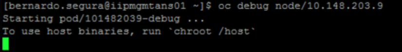
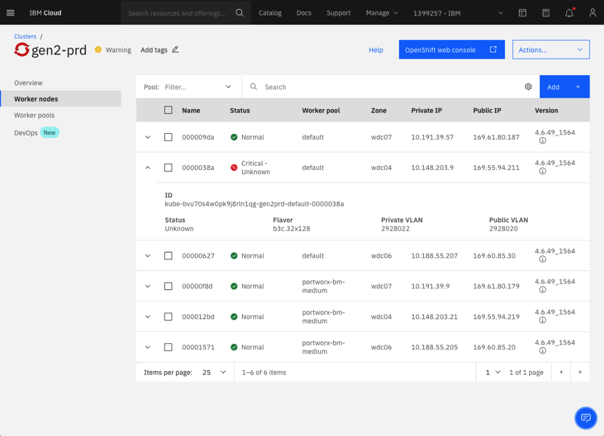
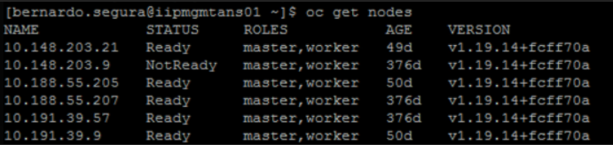
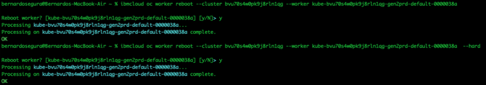
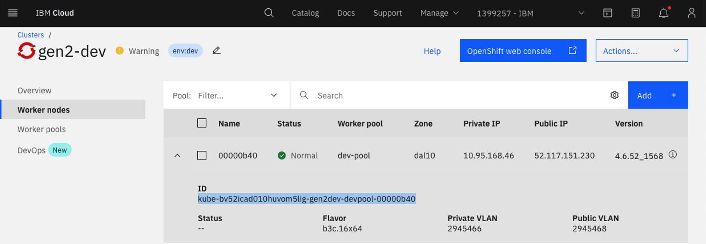

### Worker Node - Not Ready Status.
 
-  	This alert will get triggered when worker nodes goes to Not Ready state 
-  	So if we get this alert then we can describe the worker node using command `oc describe node node-ip` and see any useful events are captured in the output.
-  	Try to debug into the worker and check for the journal logs of kubelet using following commands
```
-	oc debug node/node-ip
-	chroot /host
-	journalctl -b -f -u kubelet.service
-	journalctl -b -f -u kubelet.service  --since “1 hour ago”   --this is for specific time
-	journalctl -b -f -u kubelet.service  --since “2021-10-28 23:15:00” –until “2021-10-29 23:15:00”   --this is for specific time
```

 - If the debug command doesn’t work try to reboot the WorkerNode affected.

 **- Important: No Reload, No Update, just Reboot.**



- Click on the check box and use the reboot option:





- If the first reboot doesn’t work, try to reboot two or three times more.
- At this point is highly recommended open a Case in IBM Cloud to check if all it’s working fine with the host where is located this Worker Node. 

[IBM Cloud Support Cases](https://cloud.ibm.com/unifiedsupport/supportcenter)

**Note: if you’re working in PRD or PDR Env. Reload or update is not an option no matter if IBM Cloud recommend this, if there is not any other way, please contact Sathish, Manikandan or Anand before to proceed.**


- Once the WorkerNode is in ready status check all the pods in OCP Dashboard, if you found any pod as CrashLoopBack or any unwanted status, try to delete it to have a new pod in healthy status. 

***

### Lessons learned

- WorkerNode - NotReady status

[IBM Cloud Case - CS2666659](https://cloud.ibm.com/unifiedsupport/cases?number=CS2666659)


- RCA:

[RCA Documentation](https://ibm.ent.box.com/folder/154732686936)

*** 
### Useful  commands:

- Check nodes:

``oc get nodes``



- Check node details:

```oc describe node <node-ip>```

Reboot from CLI:

- Soft reboot
```
ibmcloud oc worker reboot --cluster <ClusterID> --worker <WorkerID>

ibmcloud oc worker reboot --cluster bvu70s4w0pk9j8rln1qg --worker kube-bvu70s4w0pk9j8rln1qg-gen2prd-default-0000038a  
```

- Hard reboot:
```
ibmcloud oc worker reboot --cluster <Cluster> --worker <ID>  --hard

ibmcloud oc worker reboot --cluster bvu70s4w0pk9j8rln1qg --worker kube-bvu70s4w0pk9j8rln1qg-gen2prd-default-0000038a  --hard
```



