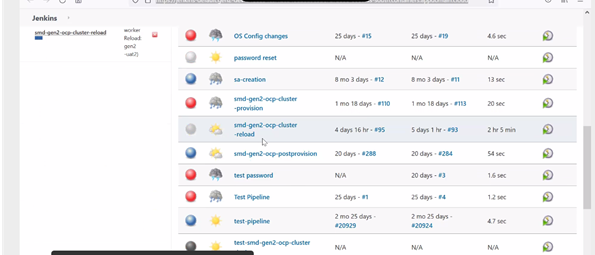
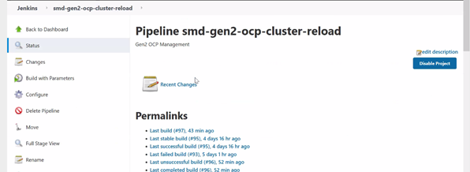
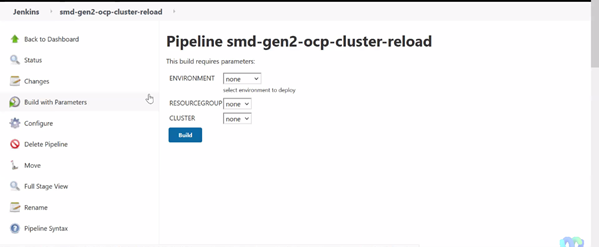
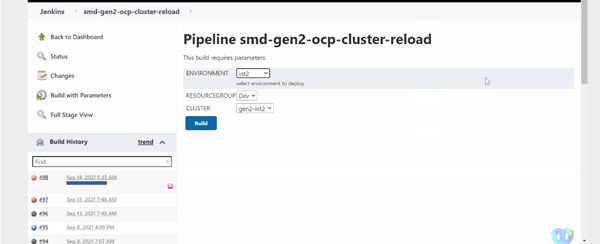
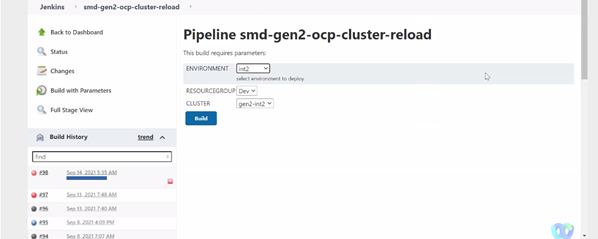
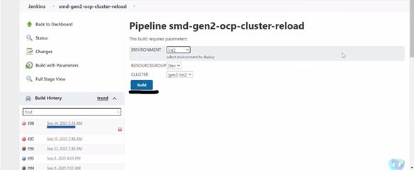
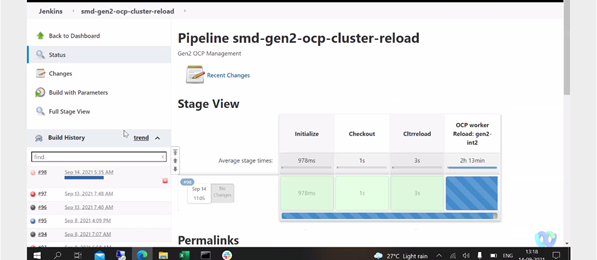
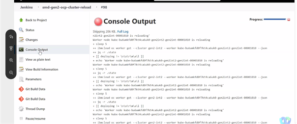
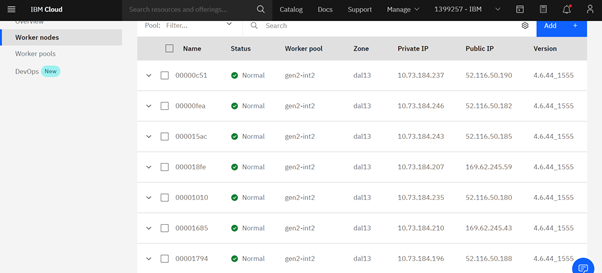

#### Steps to follow for  OCP-Worker Node Patching:
1. Login to Jenkins then go to dashboard.

2. There find the Jenkin job named “smd-gen2-ocp-cluster-reload”.

3. Then select “Build with Parameters”.

4. There select the  ENVIRONMENT to be updated. Here we are taking INT2.

5. The remaining fields RESOURCEGROUP and CLUSTER will be filled automatically.

6. Then click on build to start the OCP-Worker Node Patching.
 

7. The OCP-Worker Node patch upgrade from 4.6.38_1549 to 4.6.44_1555 is completed.

#### Post Patch Upgrade Validations:

 - Verify if all the pods are running.
    Using command:
    ` oc get po -A | grep -v “1/1\|2/2\|3/3\|4/4\|5/5\|6/6\|Completed” `
 - Validate following middleware urls working fine.
   * Cp4i navigator console
   * Ace dashboard
   * Apic UI
   * DP UI
   * MQ Connecting via MQ explorer
   * DS connecting via DS Client
